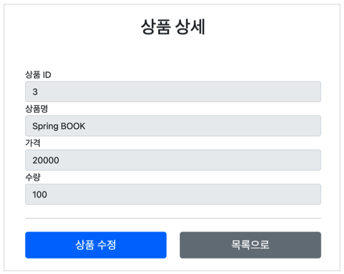
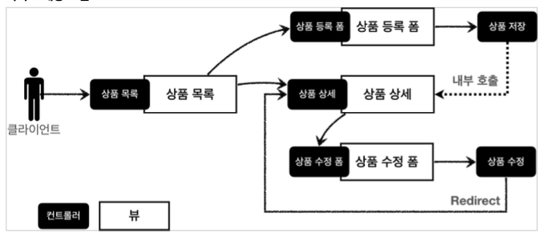

# 웹페이지 만들기 - 프로젝트 생성 및 요구사항

## 프로젝트 생성

- <https://start.spring.io>

- configs
  - 
  - 
- [index.html](./item-service/src/main/resources/static/index.html)
- 스프링 부트 실행 후 정상동작 확인

## 요구사항 분석

상품을 관리할 수 있는 서비스를 만들어보자.

- 상품 도메인 모델
  - 상품 ID
  - 상품명
  - 가격
  - 수량
- 상품 관리 기능
  - 상품 목록
  - 상품 상세
  - 상품 등록
  - 상품 수정

### 서비스 화면

- 상품 목록

- 상품 상세

### 서비스 제공 흐름

- 일반적인 개발 형태
  - 디자이너: 요구사항에 맞도록 디자인하고, 디자인 결과물을 웹 퍼블리셔에게 넘김
  - 웹 퍼블리셔: 다자이너에서 받은 디자인을 기반으로 HTML, CSS를 만들어 개발자에게 제공
  - 백엔드 개발자: 디자이너, 웹 퍼블리셔를 통해서 HTML 화면이 나오기 전까지 시스템을 설계하고, 핵심 비즈니스 모델을 개발한다. 이후 HTML이 나오면 이 HTML을 뷰 템플릿으로 변환해서 동적으로 화면전환 및 흐름을 제어
