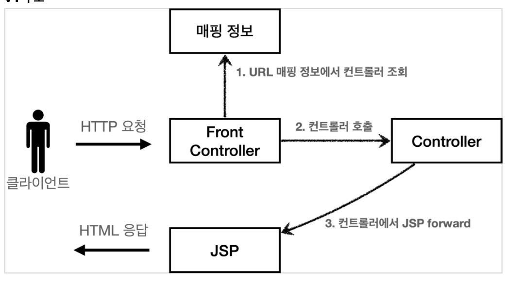

# MVC 프레임워크 만들기

- 앞서 작성한 mvc 패턴도 중복된 부분, 사용하지 않는 부분, 공통처리 등에 단점이 있었다.
- 이러한 공통 처리를 위해 프론트 컨트롤러가 도입됨

## 프론트 컨트롤러

- 프론트 컨트롤러 도입 전

- 프론트 컨트롤러 도입 후


- 프론트 컨트롤러 서블릿 하나로
- 클라이언트의 요청을 받음
- 프론트 컨트롤러가 요청에 맞는 컨트롤러를 찾아서 호출
- 입구를 하나로
- 공통처리 가능
- 프론트 컨트롤러를 제외한 나머지는 서블릿을 사용하지 않아도 됨
  - DispatcherServlet 이 프론트 컨트롤러 패턴으로 구현되어 있음

## 프론트 컨트롤러 도입 V.1

구조적으로 앞단 만들기(인터페이스 활용)
- V.1 구조

- [interface : ContollerV1](./servlet/src/main/java/hello/servlet/web/frontcontroller/v1/ControllerV1.java)
- [MemberFormControllerV1](./servlet/src/main/java/hello/servlet/web/frontcontroller/v1/controller/MemberFormControllerV1.java)
- [MemberSaveControllerV1](./servlet/src/main/java/hello/servlet/web/frontcontroller/v1/controller/MemberSaveControllerV1.java)
- [MemberListControllerV1](./servlet/src/main/java/hello/servlet/web/frontcontroller/v1/controller/MemberListControllerV1.java)
- [FrontControllerServletV1](./servlet/src/main/java/hello/servlet/web/frontcontroller/v1/FrontControllerServletV1.java)

## 프론트 컨트롤러 도입 V.2

뷰를 처리하는 부분 공통화

```java
  String viewPath = "/WEB-INF/views/new-form.jsp";
  RequestDispatcher dispatcher = request.getRequestDispatcher(viewPath);
  dispatcher.forward(request, response);
```

- V.2 구조


- [Myview](./servlet/src/main/java/hello/servlet/web/frontcontroller/MyView.java)
- [interface : ContollerV2](./servlet/src/main/java/hello/servlet/web/frontcontroller/v2/ControllerV2.java)
- [MemberFormControllerV2](./servlet/src/main/java/hello/servlet/web/frontcontroller/v2/controller/MemberFormControllerV2.java)
- [MemberSaveControllerV2](./servlet/src/main/java/hello/servlet/web/frontcontroller/v2/controller/MemberSaveControllerV2.java)
- [MemberListControllerV2](./servlet/src/main/java/hello/servlet/web/frontcontroller/v2/controller/MemberListControllerV2.java)
- [FrontControllerServletV2](./servlet/src/main/java/hello/servlet/web/frontcontroller/v2/FrontControllerServletV2.java)

## 프론트 컨트롤러 도입 V.3

모델 추가

- 서블릿 종속성 제거
  - 컨트롤러 입장에서 HttpServletRequest, HttpServletResponse이 꼭 필요할까?
- 뷰 이름 중복 제거
  - /WEB-INF/views/new-form.jsp -> new-form
  - /WEB-INF/views/save-result.jsp -> save-result
  - /WEB-INF/views/members.jsp -> members

- V.3 구조


- [Modelview](./servlet/src/main/java/hello/servlet/web/frontcontroller/ModelView.java)
  - 뷰의 이름과 뷰를 렌더링할 때 필요한 model 객체 : 뷰에 필요한 데이터를 key, value로 넣어주면 됨
- [interface : ContollerV3](./servlet/src/main/java/hello/servlet/web/frontcontroller/v3/ControllerV3.java)
  - 이 컨트롤러는 서블릿 기술을 전혀 사용하지 않는다
  - HttpServletRequest가 제공하는 파라미터는 프론트 컨트롤러가 paramMap에 담아서 호출해주면 됨
- [MemberFormControllerV3](./servlet/src/main/java/hello/servlet/web/frontcontroller/v3/controller/MemberFormControllerV3.java)
  - 논리적인 이름을 제공. frontcontroller 에서 물리 이름으로 변환(viewResolver)
- [MemberSaveControllerV3](./servlet/src/main/java/hello/servlet/web/frontcontroller/v3/controller/MemberSaveControllerV3.java)
  - parameter 정보 paramMap에 있음
- [MemberListControllerV3](./servlet/src/main/java/hello/servlet/web/frontcontroller/v3/controller/MemberListControllerV3.java)
- [FrontControllerServletV3](./servlet/src/main/java/hello/servlet/web/frontcontroller/v3/FrontControllerServletV3.java)
  - `createParamMap()`
    - HttpServletRequest에서 파라미터 정보를 꺼내서 Map으로 변환한다. 그리고 해당 `Map(paramMap)`을 컨트롤러에 전달하면서 호출한다.
  - `viewResolver`
    - 컨트롤러가 반환한 논리 뷰 이름을 실제 물리 뷰 경로로 변경
- [Myview](./servlet/src/main/java/hello/servlet/web/frontcontroller/MyView.java)
  - Myview 일부 수정
    - render부분에 Map 추가
    - jsp 에서는 `request.setAttribute`로 저장해야 `jsp` 파일에서 편리하게 호출할 수 있음

- V3로의 전환은 상속과 다형성, 람다표현식등 많은 내용을 다루고 있어서 이해하기 어려울 수 있다.
  - 복습하면서 완전히 내것으로 만들자

## 프론트 컨트롤러 도입 V.4

앞서 만든 v3 컨트롤러는 서블릿 종속성을 제거하고 뷰 경로의 중복을 제거하는 등, 잘 설계된 컨트롤러이다.
하지만,

```text
- 항상 ModelView 객체를 생성하고 반환해야 하는 부분이 조금은 번거롭다.
  - 좋은 프레임워크는 아키텍처도 중요하지만, 그와 더불어 실제 개발하는 개발자가 단순하고 편리하게 사용할 수 있어야 한다
- v3를 조금 변경해서 실제 구현하는 개발자들이 매우 편리하게 개발할 수 있는 v4 버전 만들기
```

- V.4 구조

- 기본적인 구조는 V3와 같다. 대신에 컨트롤러가 `ModelView` 를 반환하지 않고, `ViewName` 만 반환한다.


- [interface : ContollerV4](./servlet/src/main/java/hello/servlet/web/frontcontroller/v4/ControllerV4.java)
- [MemberFormControllerV4](./servlet/src/main/java/hello/servlet/web/frontcontroller/v4/controller/MemberFormControllerV4.java)
  - 정말 단순하게 new-form 이라는 뷰의 논리 이름만 반환하면 된다.
- [MemberSaveControllerV4](./servlet/src/main/java/hello/servlet/web/frontcontroller/v4/controller/MemberSaveControllerV4.java)
  - 모델이 파라미터로 전달되기 때문에, 모델을 직접 생성하지 않아도 된다.
- [MemberListControllerV4](./servlet/src/main/java/hello/servlet/web/frontcontroller/v4/controller/MemberListControllerV4.java)
- [FrontControllerServletV4](./servlet/src/main/java/hello/servlet/web/frontcontroller/v4/FrontControllerServletV4.java)

- 기존 구조에서 모델을 파라미터로 넘기고, 뷰의 논리 이름을 반환한다는 작은 아이디어를 적용했을 뿐인데, 컨트롤러를 구현하는 개발자 입장에서 보면 이제 군더더기 없는 코드를 작성할 수 있다
- 프레임워크나 공통 기능이 수고로워야 사용하는 개발자가 편리해진다.

## 프론트 컨트롤러 도입 V.5

한 프로젝트 내에서 서로 다른 방식의 컨트롤러를 사용하고 싶다면 어떨까?

```java
public interface ControllerV3 {
        ModelView process(Map<String, String> paramMap);
}
public interface ControllerV4 {
        String process(Map<String, String> paramMap, Map<String, Object> model);
}
```

```text
- 현 v4 구조에서는 프론트 컨트롤러는 한가지 컨트롤러만 사용할 수 있음
- 이를 위해 어댑터 패턴을 적용하여 다양한 컨트롤러를 처리할 수 있도록 변경
```

- V.5 구조

  - 핸들러 어댑터: 중간에 어댑터 역할을 하는 어댑터가 추가되었는데 이름이 핸들러 어댑터이다. 여기서 어댑터 역할을 해주는 덕분에 다양한 종류의 컨트롤러를 호출할 수 있다.
  - 핸들러: 컨트롤러의 이름을 더 넓은 범위인 핸들러로 변경했다. 그 이유는 이제 어댑터가 있기 때문에 꼭 컨트롤러의 개념 뿐만 아니라 어떠한 것이든 해당하는 종류의 어댑터만 있으면 다 처리할 수 있기 때문이다.

- [interface : MyHandlerAdapter](./servlet/src/main/java/hello/servlet/web/frontcontroller/v5/MyHandlerAdapter.java)
  - `boolean supports(Object handler)`
    - handler는 컨트롤러를 말한다.
    - 어댑터가 해당 컨트롤러를 처리할 수 있는지 판단하는 메서드
  - `ModelView handle(HttpServletRequest request, HttpServletResponse response, Object handler)`
    - 어댑터는 실제 컨트롤러를 호출하고, 그 결과로 ModelView를 반환
    - 실제 컨트롤러가 ModelView를 반환하지 못하면, 어댑터가 ModelView를 직접 생성해서라도 반환
    - 이전에는 프론트 컨트롤러가 실제 컨트롤러를 호출했지만 이제는 이 어댑터를 통해서 실제 컨트롤러가 호출
- [ControllerV3HandlerAdapter](./servlet/src/main/java/hello/servlet/web/frontcontroller/v5/adapter/ControllerV3HandlerAdapter.java)
  - `supports(Object handler)`
    - 처리할 수 있는지 판단
  - `handle()`
    - handler를 컨트롤러 V3로 변환한 다음에 V3 형식에 맞도록 호출한다
- [FrontControllerServlerV5](./servlet/src/main/java/hello/servlet/web/frontcontroller/v5/FrontControllerServletV5.java)
  - 구조 그림을 보면 순서대로 실행하는 것을 알 수 있음
- 여기까지 하면 V3 적용 완료. 다음 코드는 V4 적용과정
  - `initHandlerMappingMap`, `initHandlerAdapters` 수정
  - [ControllerV4HandlerAdapter](./servlet/src/main/java/hello/servlet/web/frontcontroller/v5/adapter/ControllerV4HandlerAdapter.java)
    - V4의경우 ModelView 를 만들어서 반환해야 함
      - viewname 을 modelview 만들어서 반환!


## 마무리 정리

- 여기서 더 발전시키면 좋겠지만, 스프링 MVC의 핵심 구조를 파악하는데 필요한 부분은 모두 만들어보았다.
- 사실은 여러분이 지금까지 작성한 코드는 스프링 MVC 프레임워크의 핵심 코드의 축약 버전이고, 구조도 거의 같다.