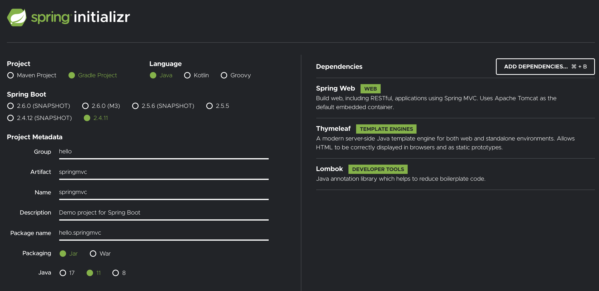
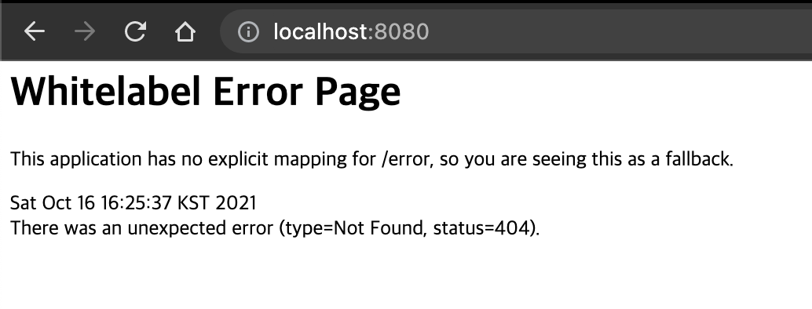

# Spring initializer 사용해서 프로젝트 생성

- spring boot 사용
- <https://start.spring.io/>

## 사용한 설정

- 프로젝트 선택
  - Project: Gradle Project
  - Language: Java
  - Spring Boot: 2.4.x
- Project Metadata 
  - Group: hello
  - Artifact: springmvc
  - Name: springmvc
  - Package name: hello.springmvc 
  - Packaging: Jar (주의!)
  - Java: 11
- Dependencies
  - Spring Web, Thymeleaf, Lombok

> Packaging는 War가 아니라 Jar를 선택
> Jar를 사용하면 항상 내장 서버(톰캣등)을 사용하고, webapp 경로도 사용하지 않음
> 내장 서버 사용에 최적화 되어 있는 기능, 최근에는 주로 이 방식을 사용
>> War를 사용하면 내장 서버도 사용가능 하지만, 주로 외부 서버에 배포하는 목적

## 프로젝트 동작 확인

- <http://localhost:8080>

## Welcome page 만들기

- /resources/static/index.hml
- [index.html](./springmvc/src/main/resources/static/index.html)