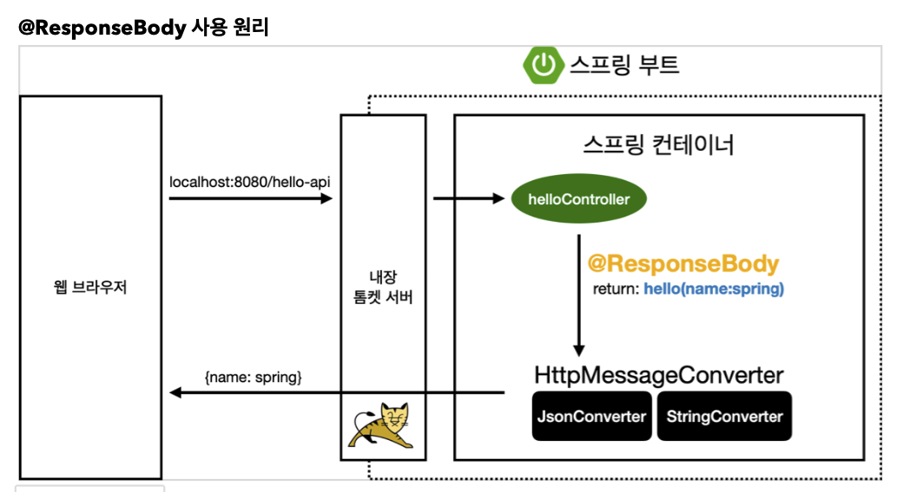
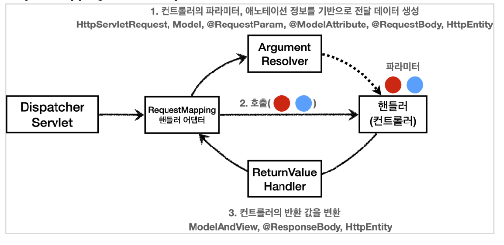
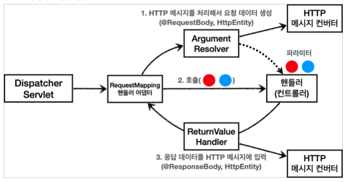

# Http 메시지 컨버터 및 동작 원리

## Http 메시지 컨버터

뷰 템플릿으로 HTML을 생성해서 응답하는 것이 아니라, HTTP API처럼 JSON 데이터를 HTTP 메시지
바디에서 직접 읽거나 쓰는 경우 HTTP 메시지 컨버터를 사용하면 편리함

httpconverter 설명하기 앞서서...

`@ResponseBody` 사용 원리


- HTTP의 BODY에 문자 내용을 직접 반환
- viewResolver 대신에 HttpMessageConverter 가 동작
- 기본 문자처리: `StringHttpMessageConverter`
- 기본 객체처리: `MappingJackson2HttpMessageConverter`
- byte 처리 등등 기타 여러 `HttpMessageConverter`가 기본으로 등록되어 있음

**스프링 MVC는 다음의 경우에 HTTP 메시지 컨버터를 적용한다.**

- HTTP 요청: @RequestBody , HttpEntity(RequestEntity)
- HTTP 응답: @ResponseBody , HttpEntity(ResponseEntity)

`org.springframework.http.converter.HttpMessageConverter`

```java
package org.springframework.http.converter;
    public interface HttpMessageConverter<T> {
      boolean canRead(Class<?> clazz, @Nullable MediaType mediaType);
      boolean canWrite(Class<?> clazz, @Nullable MediaType mediaType);
      List<MediaType> getSupportedMediaTypes();
      T read(Class<? extends T> clazz, HttpInputMessage inputMessage)
              throws IOException, HttpMessageNotReadableException;
      void write(T t, @Nullable MediaType contentType, HttpOutputMessage
    outputMessage)
              throws IOException, HttpMessageNotWritableException;
}
```

- canRead() , canWrite() : 메시지 컨버터가 해당 클래스, 미디어타입을 지원하는지 체크
  - 클래스타입, 미디어 타입 두가지 모두 체크
- read() , write() : 메시지 컨버터를 통해서 메시지를 읽고 쓰는 기능

스프링 부트 기본 메시지 컨버터

```text
0 = ByteArrayHttpMessageConverter
1 = StringHttpMessageConverter
2 = MappingJackson2HttpMessageConverter
```

- ByteArrayHttpMessageConverter : byte[] 데이터를 처리한다.
  - 클래스 타입: byte[] , 미디어타입: \*/* ,
  - 요청 예) @RequestBody byte[] data
  - 응답 예) @ResponseBody return byte[] 쓰기 미디어타입 application/octet-stream
- StringHttpMessageConverter : String 문자로 데이터를 처리한다.
  - 클래스 타입: String , 미디어타입: \*/*
  - 요청 예) @RequestBody String data
  - 응답 예) @ResponseBody return "ok" 쓰기 미디어타입 text/plai
- MappingJackson2HttpMessageConverter : application/json
  - 클래스 타입: 객체 또는 HashMap , 미디어타입 application/json 관련
  - 요청 예) @RequestBody HelloData data
  - 응답 예) @ResponseBody return helloData 쓰기 미디어타입 application/json 관련

1. `StringHttpMessageConverter`

```java
content-type: application/json
@RequestMapping
void hello(@RequetsBody String data) {}
```

2. `MappingJackson2HttpMessageConverter`

```java
content-type: application/json
@RequestMapping
void hello(@RequetsBody HelloData data) {}
```

3. `X(에러)`

```java
content-type: text/html
@RequestMapping
void hello(@RequetsBody String data) {}
```

- HTTP 요청 데이터 읽기
  - HTTP 요청이 오고, 컨트롤러에서 @RequestBody , HttpEntity 파라미터를 사용한다. 메시지 컨버터가 메시지를 읽을 수 있는지 확인하기 위해 canRead() 를 호출한다.
    - 대상 클래스 타입을 지원하는가.
      - 예) @RequestBody 의 대상 클래스 ( byte[] , String , HelloData )
    - HTTP 요청의 Content-Type 미디어 타입을 지원하는가.
      - 예) text/plain , application/json , \*/*
  - canRead() 조건을 만족하면 read() 를 호출해서 객체 생성하고, 반환한다.

- HTTP 응답 데이터 생성
  - 컨트롤러에서 @ResponseBody , HttpEntity 로 값이 반환된다.
  - 메시지 컨버터가 메시지를 쓸 수 있는지 확인하기 위해 canWrite() 를 호출한다.
    - 대상 클래스 타입을 지원하는가.
      - 예) return의 대상 클래스 ( byte[] , String , HelloData )
    - HTTP 요청의 Accept 미디어 타입을 지원하는가.(더 정확히는 @RequestMapping 의 produces )
      - 예) text/plain , application/json , \*/*
  - canWrite() 조건을 만족하면 write() 를 호출해서 HTTP 응답 메시지 바디에 데이터를 생성한다.

## Request Mapping Handler Adapter 구조 및 동작 과정(컨버터 동작 포함)

- spring mvc 구조


- 어디에서 메세지 컨버터가 호출되고 동작하는걸까?
  - 모든 과정이 @RequestMapping 을 처리하는 핸들러 어댑터인 `RequestMappingHandlerAdapter` (요청 매핑 헨들러 어뎁터)에 있다

- RequestMappingHandlerAdapter 동작 방식
- 

### ArgumentResolver

- `RequestMappingHandlerAdaptor` 줄여서 ArgumentResolver
- `ArgumentResolver` 가 HttpServletRequest ,Model 은 물론이고, @RequestParam , @ModelAttribute 같은 애노테이션 그리고 @RequestBody , HttpEntity 같은 HTTP 메시지까지 유연하게 처리를 해 준다.
- RequestMappingHandlerAdaptor 는 ArgumentResolver 를 호출해서 컨트롤러가 필요로 하는 다양한 파라미터 값을 생성하고 넘겨준다.
- 30개가 넘는 ArgumentResolver 제공

> 공식문서
> <https://docs.spring.io/spring-framework/docs/current/reference/html/web.html#mvc-ann-arguments>

`HandlerMethodArgumentResolver`

```java
public interface HandlerMethodArgumentResolver {
      boolean supportsParameter(MethodParameter parameter);
@Nullable
      Object resolveArgument(MethodParameter parameter, @Nullable
    ModelAndViewContainer mavContainer,
              NativeWebRequest webRequest, @Nullable WebDataBinderFactory
    binderFactory) throws Exception;
}
```

- HandlerMethodArgumentResolver 의 구현체를 보면 얼마나 많은지 알 수 있음.
- ArgumentResolver 의 supportsParameter() 를 호출해서 해당 파라미터를 지원하는지 체크하고, 지원하면 resolveArgument() 를 호출해서 실제 객체를 생성
- 인터페이스로 설계외어 있어서 기능을 확장하기 쉬움
  - 커스텀 하게 ArgumentResolver 를 만들수 있음

### ReturnValueHandler

- `HandlerMethodReturnValueHandler` 를 줄여서 `ReturnValueHandle`
- 컨트롤러에서 String으로 뷰 이름을 반환해도, 동작하는 이유가 바로 ReturnValueHandler 덕분
  - 코드로 확인
- 10여개가 넘는 ReturnValueHandler 를 지원

> 공식 문서
> <https://docs.spring.io/spring-framework/docs/current/reference/html/web.html#mvc-ann-return-types>

### HttpMessageConverter



- 요청의 경우 @RequestBody 를 처리하는 ArgumentResolver 가 있고, HttpEntity 를 처리하는 ArgumentResolver 가 있다. 이 ArgumentResolver 들이 HTTP 메시지 컨버터를 사용해서 필요한 객체를 생성
- 응답의 경우 @ResponseBody 와 HttpEntity 를 처리하는 ReturnValueHandler 가 있다. 그리고 여기에서 HTTP 메시지 컨버터를 호출해서 응답 결과를 만듦
- 예) @RequestBody @ResponseBody 가 있으면
  - RequestResponseBodyMethodProcessor(ArgumentResolver)
- 예) HttpEntity 가 있으면
  - HttpEntityMethodProcessor(ArgumentResolver)

### 확장

모두 인터페이스로 제공 -> 언제든지 확장 가능

- HandlerMethodArgumentResolver
- HandlerMethodReturnValueHandler
- HttpMessageConverter

- 실제 기능확장하는 경우는 많지 않음...
- 하지만, 필요한 경우 기능 확장은 `WebConfigurer` 를 상속받아서 스프링 빈으로 등록하는 방식

```java
@Bean
public WebMvcConfigurer webMvcConfigurer() {
  return new WebMvcConfigurer() {
    @Override
    public void addArgumentResolvers(List<HandlerMethodArgumentResolver>
resolvers) {
  ////
    }
    @Override
    public void extendMessageConverters(List<HttpMessageConverter<?>>
    converters) {
    //...
    }
  };
}
```

- 실제 사용방식은 필요할 때 검색하서 알아보자

