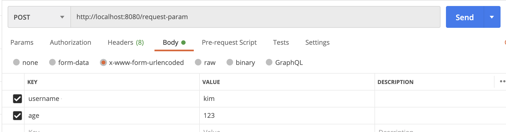

# Http 요청 데이터

## 개요

- 데이터를 전송하는 방법

### GET

- 쿼리 파라미터
- /url?username=hello&age=20

### POST

- content-type: application x-www-form-urlencoded
- 메시지 바디에 쿼리 파리미터 형식으로 전달 username=hello&age=20

### Http message body

- HTTP API에서 주로 사용, JSON, XML, TEXT

## GET 방식 쿼리 파라미터

### 쿼리 예시

- http://localhost:8080/request-param?username=hello&age=20
  - request.getParameter() 로 정보 꺼내서 씀
- http://localhost:8080/request-param?username=hello&age=20&username=hello2
  - 중복일 때는 request.getParameterValues() 를 사용

## POST 방식 쿼리 파라미터

### 특징

- content-type: application/x-www-form-urlencoded
메시지 바디에 쿼리 파리미터 형식으로 데이터를 전달한다. 
- username=hello&age=20

### 예제

1. 다음과 같이 x-www-form-urlencoded 형식으로 보내는 방법

```html
<form action="/request-param" method="post">
    username: <input type="text" name="username" /> age: <input type="text" name="age" /> <button type="submit">전송</button>
</form>
```

- src/main/webapp/basic/hello-form.html 생성
- 다음 url로 실행
  - <http://localhost:8080/basic/hello-form.html>
  - **요청 URL**: <http://localhost:8080/request-param>
  - **content-type**: application/x-www-form-urlencoded - **message** body: username=hello&age=20

2. postman으로 실행

   - 데이터가 전달되는 과정은 똑같음

### 참고

- **GET URL 쿼리 파라미터** 형식으로 클라이언트에서 서버로 데이터를 전달할 때는 HTTP 메시지 바디를 사용하지 않기 때문에 content-type이 없다.
- **POST HTML Form** 형식으로 데이터를 전달하면 HTTP 메시지 바디에 해당 데이터를 포함해서 보내기 때문에 바디에 포함된 데이터가 어떤 형식인지 content-type을 꼭 지정해야 한다. 이렇게 폼으로 데이터를 전송하는 형식을 *application/x-www-form-urlencoded* 라 한다.

## HTTP 요청 데이터 - API 메시지 바디 - 단순 텍스트

- HTTP message body에 데이터를 직접 담아서 요청
  - HTTP API에서 주로 사용, JSON, XML, TEXT
  - 데이터 형식은 주로 JSON 사용
  - POST, PUT, PATCH

```java
ServletInputStream inputStream = request.getInputStream();
String messageBody = StreamUtils.copyToString(inputStream, StandardCharsets.UTF_8);
System.out.println("messageBody = " + messageBody);
response.getWriter().write("ok");
```

- POST <http://localhost:8080/request-body-string>
- content-type : text/plain
- message body : hello
- 결과: messageBody = hello

## HTTP 요청 데이터 - API 메시지 바디 - JSON

- JSON 형식 전송
  - POST http://localhost:8080/request-body-json 
  - content-type: application/json
  - message body: {"username": "hello", "age": 20} 
  - 결과: messageBody = {"username": "hello", "age": 20}

- Object 담을 객체

```java
@Getter @Setter
public class HelloData {
    private String username;
    private int age;
}
```

- 변환 코드
  
```java
ServletInputStream inputStream = request.getInputStream();
String messageBody = StreamUtils.copyToString(inputStream, StandardCharsets.UTF_8);
System.out.println("messageBody = " + messageBody);
HelloData helloData = objectMapper.readValue(messageBody,HelloData.class);
System.out.println("helloData = " + helloData);
System.out.println("helloData.getUsername() = " + helloData.getUsername());
System.out.println("helloData.getAge() = " + helloData.getAge());
```


> 참고
> JSON 결과를 파싱해서 사용할 수 있는 자바 객체로 변환하려면 Jackson, Gson 같은 JSON 변환 라이브러리를 추가해서 사용해야 한다. 스프링 부트로 Spring MVC를 선택하면 기본으로 Jackson 라이브러리( ObjectMapper )를 함께 제공한다.

