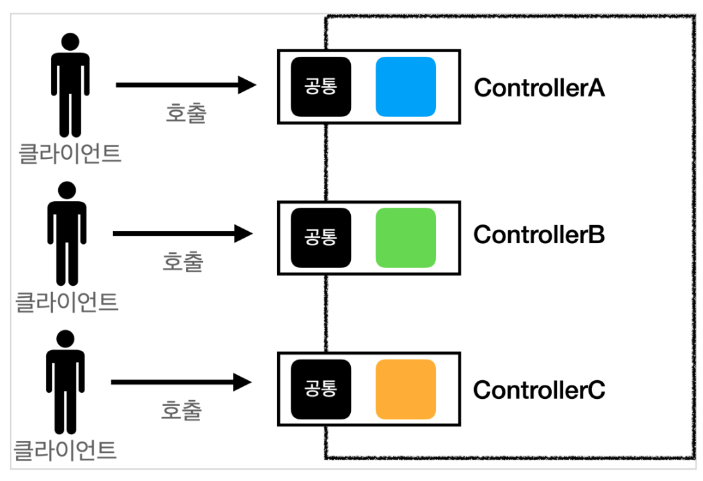
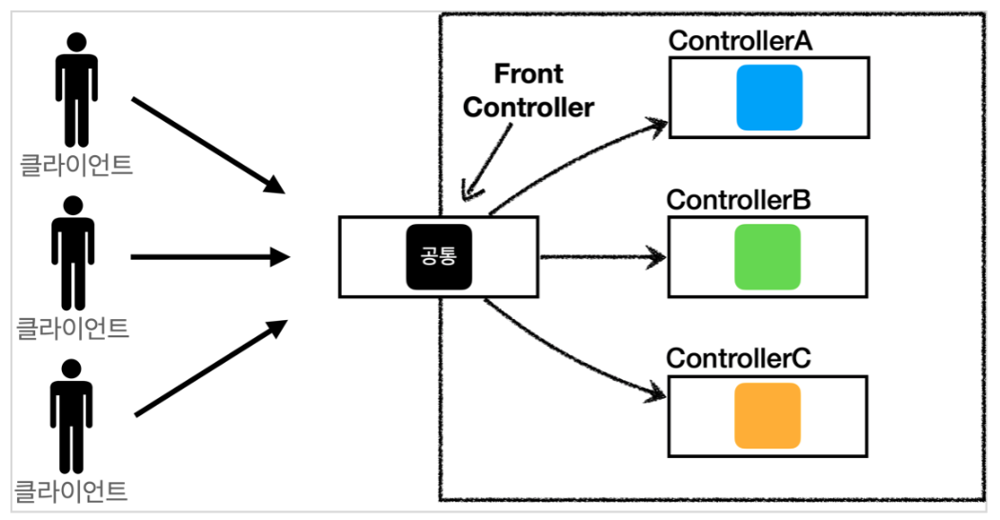
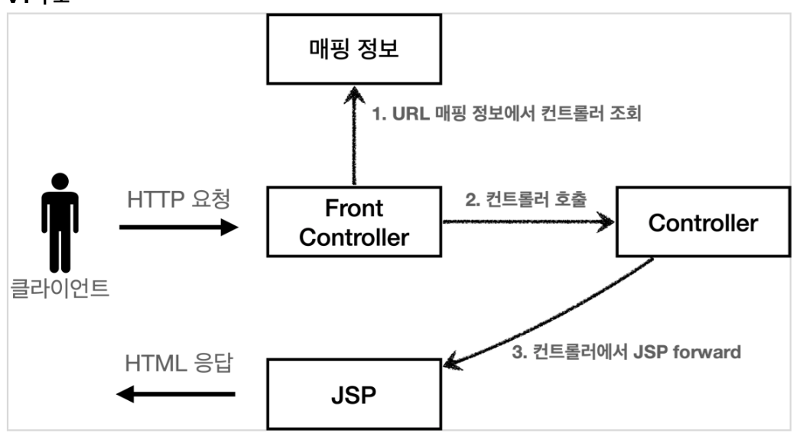
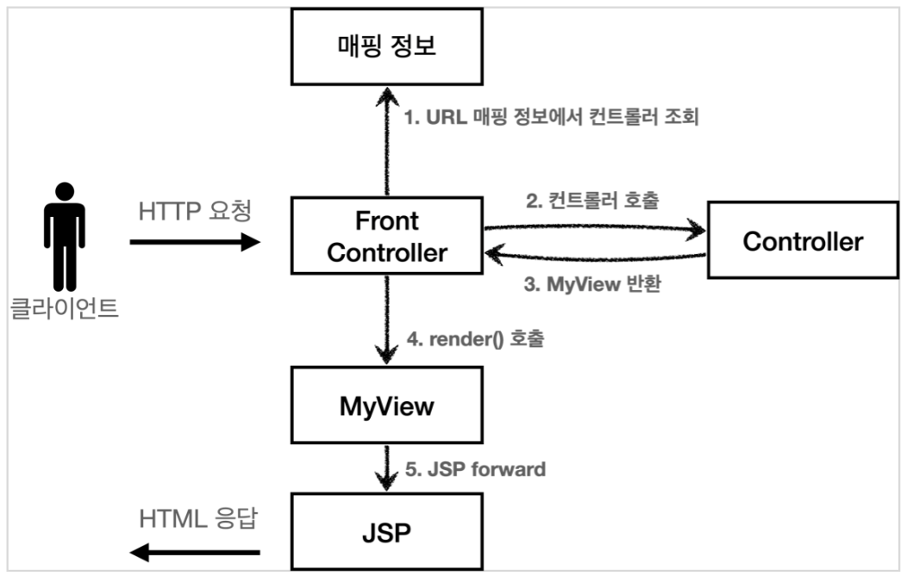
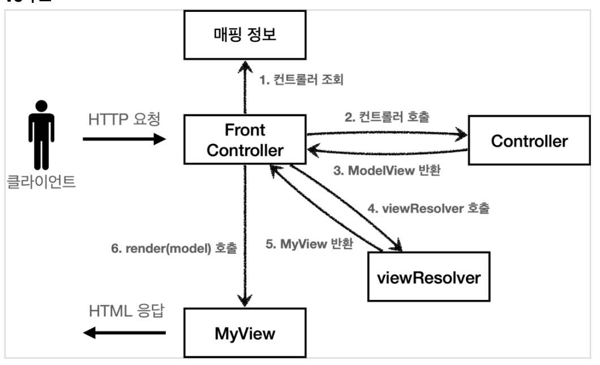

# MVC 프레임워크 만들기

- 앞서 작성한 mvc 패턴도 중복된 부분, 사용하지 않는 부분, 공통처리 등에 단점이 있었다.
- 이러한 공통 처리를 위해 프론트 컨트롤러가 도입됨

## 프론트 컨트롤러

- 프론트 컨트롤러 도입 전

- 프론트 컨트롤러 도입 후


- 프론트 컨트롤러 서블릿 하나로
- 클라이언트의 요청을 받음
- 프론트 컨트롤러가 요청에 맞는 컨트롤러를 찾아서 호출
- 입구를 하나로
- 공통처리 가능
- 프론트 컨트롤러를 제외한 나머지는 서블릿을 사용하지 않아도 됨
  - DispatcherServlet 이 프론트 컨트롤러 패턴으로 구현되어 있음

## 프론트 컨트롤러 도입 V.1

구조적으로 앞단 만들기(인터페이스 활용)
- V.1 구조

- [interface : ContollerV1](./servlet/src/main/java/hello/servlet/web/frontcontroller/v1/ControllerV1.java)
- [MemberFormControllerV1](./servlet/src/main/java/hello/servlet/web/frontcontroller/v1/controller/MemberFormControllerV1.java)
- [MemberSaveControllerV1](./servlet/src/main/java/hello/servlet/web/frontcontroller/v1/controller/MemberSaveControllerV1.java)
- [MemberListControllerV1](./servlet/src/main/java/hello/servlet/web/frontcontroller/v1/controller/MemberListControllerV1.java)
- [FrontControllerServletV1](./servlet/src/main/java/hello/servlet/web/frontcontroller/v1/FrontControllerServletV1.java)

## 프론트 컨트롤러 도입 V.2

뷰를 처리하는 부분 공통화

```java
  String viewPath = "/WEB-INF/views/new-form.jsp";
  RequestDispatcher dispatcher = request.getRequestDispatcher(viewPath);
  dispatcher.forward(request, response);
```

- V.2 구조


- [Myview](./servlet/src/main/java/hello/servlet/web/frontcontroller/MyView.java)
- [interface : ContollerV2](./servlet/src/main/java/hello/servlet/web/frontcontroller/v2/ControllerV2.java)
- [MemberFormControllerV2](./servlet/src/main/java/hello/servlet/web/frontcontroller/v2/controller/MemberFormControllerV2.java)
- [MemberSaveControllerV2](./servlet/src/main/java/hello/servlet/web/frontcontroller/v2/controller/MemberSaveControllerV2.java)
- [MemberListControllerV2](./servlet/src/main/java/hello/servlet/web/frontcontroller/v2/controller/MemberListControllerV2.java)
- [FrontControllerServletV2](./servlet/src/main/java/hello/servlet/web/frontcontroller/v2/FrontControllerServletV2.java)

## 프론트 컨트롤러 도입 V.3

모델 추가

- 서블릿 종속성 제거
  - 컨트롤러 입장에서 HttpServletRequest, HttpServletResponse이 꼭 필요할까?
- 뷰 이름 중복 제거
  - /WEB-INF/views/new-form.jsp -> new-form
  - /WEB-INF/views/save-result.jsp -> save-result
  - /WEB-INF/views/members.jsp -> members

- V.3 구조


- [Modelview](./servlet/src/main/java/hello/servlet/web/frontcontroller/ModelView.java)
- [Myview](./servlet/src/main/java/hello/servlet/web/frontcontroller/MyView.java)
  - Myview 일부 수정
    - render부분에 Map 추가
- [interface : ContollerV3](./servlet/src/main/java/hello/servlet/web/frontcontroller/v3/ControllerV3.java)
- [MemberFormControllerV3](./servlet/src/main/java/hello/servlet/web/frontcontroller/v3/controller/MemberFormControllerV3.java)
- [MemberSaveControllerV3](./servlet/src/main/java/hello/servlet/web/frontcontroller/v3/controller/MemberSaveControllerV3.java)
- [MemberListControllerV3](./servlet/src/main/java/hello/servlet/web/frontcontroller/v3/controller/MemberListControllerV3.java)
- [FrontControllerServletV3](./servlet/src/main/java/hello/servlet/web/frontcontroller/v3/FrontControllerServletV3.java)

- V3로의 전환은 상속과 다형성, 람다표현식등 많은 내용을 다루고 있어서 이해하기 어려울 수 있다.
  - 복습하면서 완전히 내것으로 만들자