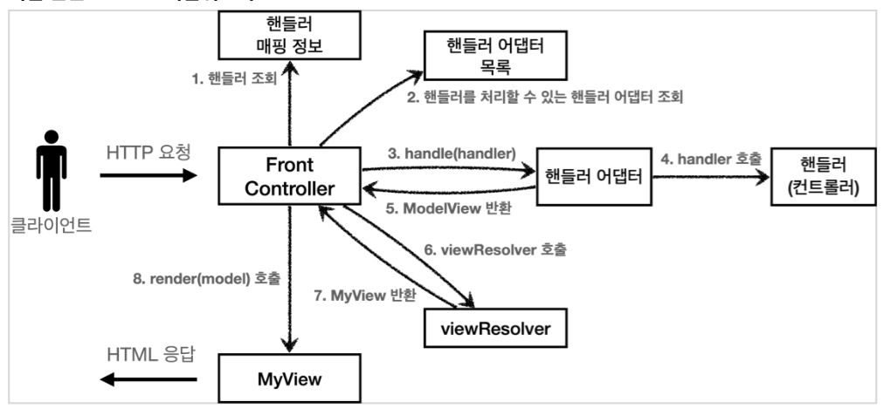
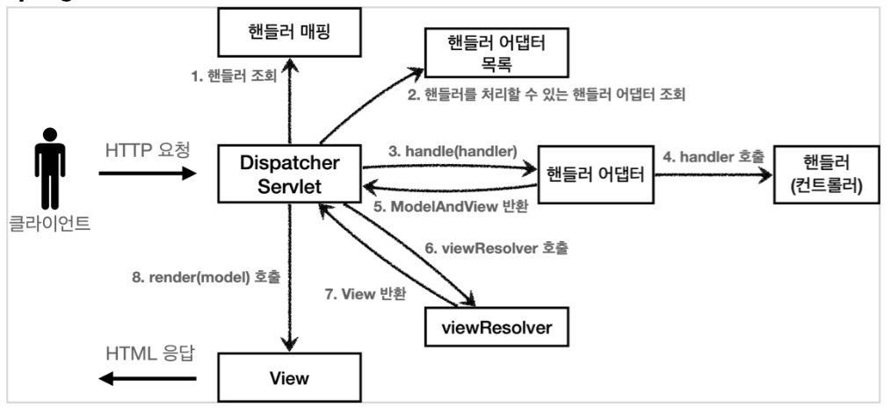

# Spring MVC 구조

- 직접 만든 MVC 구조


- Spring MVC 구조


사실상 이름 말고는 똑같은 구조이다.

## Spring MVC 전체 구조

### `DispatcherServlet` 구조 살펴보기

`org.springframework.web.servlet.DispatcherServlet`

- 프론트 컨트롤러 패턴으로 구현되어 있다.
- 디스패처 서블릿이 바로 스프링 MVC의 핵심
- `DispatcherServlet` 도 부모 클래스에서 HttpServlet 을 상속 받아서 사용하고, 서블릿으로 동작함
- `DispatcherServlet` 을 서블릿으로 자동으로 등록하면서 모든 경로( urlPatterns="/" )에 대해서 매핑
- 진짜 똑같나? 코드로 보자

`[DispatcherServlet] doDispatch()`

```java
protected void doDispatch(HttpServletRequest request, HttpServletResponse response) throws Exception {
  HttpServletRequest processedRequest = request;
  HandlerExecutionChain mappedHandler = null;
  ModelAndView mv = null;
  // 1. 핸들러 조회
  mappedHandler = getHandler(processedRequest); 
  if (mappedHandler == null) {
    noHandlerFound(processedRequest, response);
    return; 
  }
  // 2.핸들러 어댑터 조회-핸들러를 처리할 수 있는 어댑터
  HandlerAdapter ha = getHandlerAdapter(mappedHandler.getHandler());
  // 3. 핸들러 어댑터 실행 
  // 4. 핸들러 어댑터를 통해 핸들러 실행 
  // 5. ModelAndView 반환 
  mv = ha.handle(processedRequest, response, mappedHandler.getHandler());
  processDispatchResult(processedRequest, response, mappedHandler, mv, dispatchException);
}
private void processDispatchResult(HttpServletRequest request, HttpServletResponse response, HandlerExecutionChain mappedHandler, ModelAndView mv, Exception exception) throws Exception {
  // 뷰 렌더링 호출
  render(mv, request, response);
}
protected void render(ModelAndView mv, HttpServletRequest request,
HttpServletResponse response) throws Exception {
  View view;
  String viewName = mv.getViewName(); 
  // 6. 뷰 리졸버를 통해서 뷰 찾기
  // 7.View 반환
  view = resolveViewName(viewName, mv.getModelInternal(), locale, request);

  //8. 뷰 렌더링
  view.render(mv.getModelInternal(), request, response);
}
```

### 동작 순서

- Spring MVC 구조


1. 핸들러 조회: 핸들러 매핑을 통해 요청 URL에 매핑된 핸들러(컨트롤러)를 조회한다.
2. 핸들러 어댑터 조회: 핸들러를 실행할 수 있는 핸들러 어댑터를 조회한다.
3. 핸들러 어댑터 실행: 핸들러 어댑터를 실행한다.
4. 핸들러 실행: 핸들러 어댑터가 실제 핸들러를 실행한다.
5. ModelAndView 반환: 핸들러 어댑터는 핸들러가 반환하는 정보를 ModelAndView로 변환해서 반환한다.
6. viewResolver 호출: 뷰 리졸버를 찾고 실행한다.
   - JSP의 경우: InternalResourceViewResolver 가 자동 등록되고, 사용된다.
7. View반환:뷰리졸버는 뷰의 논리이름을 물리이름으로 바꾸고,렌더링역할을 담당하는 뷰객체를 반환한다.
   - JSP의 경우 InternalResourceView(JstlView) 를 반환하는데, 내부에 forward() 로직이 있다.
8. 뷰렌더링: 뷰를 통해서 뷰를 렌더링한다.

### 주요 인터페이스

- 핸들러 매핑: org.springframework.web.servlet.HandlerMapping
- 핸들러 어댑터: org.springframework.web.servlet.HandlerAdapter
- 뷰 리졸버: org.springframework.web.servlet.ViewResolver
- 뷰: org.springframework.web.servlet.View

> - 스프링 MVC의 큰 강점은 DispatcherServlet 코드의 변경 없이, 원하는 기능을 변경하거나 확장할 수 있다는 점이다.
> - 지금까지 설명한 대부분을 확장 가능할 수 있게 인터페이스로 제공한다.
> - 이 인터페이스들만 구현해서 DispatcherServlet 에 등록하면 여러분만의 컨트롤러를 만들 수도 있다

### 정리

- 내부구조를 모두 파악하는것은 쉽지 않지만, 핵심 로직은 단순하다. 전체적인 구조를 이해하자.
- 확장포인트 필요할 때, 문제가 났을 때 도움이 될 것이다.

## 핸들러 매핑과 핸들러

지금은 전혀 사용하지 않지만, 과거에 주로 사용했던 스프링이 제공하는 간단한 컨트롤러로 핸들러 매핑과 어댑터를 이해해보자

- 과거버전 스프링 컨트롤러
- `org.springframework.web.servlet.mvc.Controller`

  ```java
  public interface Controller {
      ModelAndView handleRequest(HttpServletRequest request, HttpServletResponse response) throws Exception;
  }
  ```

  > 현재 사용하는 `@Controller` 와는 전혀 다르다.

- OldController(과거버전 컨트롤러) 구현하기
- [OldController](./servlet/src/main/java/hello/servlet/web/springmvc/old/OldController.java)
  - @Component : 이 컨트롤러는 /springmvc/old-controller 라는 이름의 스프링 빈으로 등록되었다. 빈의 이름으로 URL을 매핑할 것이다.
  - <http://localhost:8080/springmvc/old-controller>
- 이 컨트롤러는 어떻게 호출되는 것일까?
  - 컨트롤러가 호출되려면... 2가지 필요
    - **HandlerMapping(핸들러 매핑)**
      - 핸들러 매핑에서 이 컨트롤러를 찾을 수 있어야 한다.
      - (예) 스프링 빈의 이름으로 핸들러를 찾을 수 있는 핸들러 매핑이 필요하다.  
    - **HandlerAdapter(핸들러 어댑터)**
      - 핸들러 매핑을 통해서 찾은 핸들러를 실행할 수 있는 핸들러 어댑터가 필요하다.
      - (예) Controller 인터페이스를 실행할 수 있는 핸들러 어댑터를 찾고 실행해야 한다

- 스프링 부트가 자동 등록하는 핸들러 매핑과 핸들러 어댑터
  - HandlerMapping
    - 0 = RequestMappingHandlerMapping : 애노테이션 기반의 컨트롤러인 @RequestMapping에서 사용
    - 1 = BeanNameUrlHandlerMapping : 스프링 빈의 이름으로 핸들러를 찾는다.
  - HandlerAdapter
    - 0 = RequestMappingHandlerAdapter : 애노테이션 기반의 컨트롤러인 @RequestMapping에서 사용
    - 1 = HttpRequestHandlerAdapter : HttpRequestHandler 처리
    - 2 = SimpleControllerHandlerAdapter : Controller 인터페이스(애노테이션X, 과거에 사용) 처리
- 지금 경우에는 1,2
  - HandlerMapping = BeanNameUrlHandlerMapping
  - HandlerAdapter = SimpleControllerHandlerAdapter

### HttpRequestHandler

`HttpRequestHandler핸들러(컨트롤러)`는 서블릿과 가장 유사한 형태의 핸들러이다.

```java
public interface HttpRequestHandler {
  void handleRequest(HttpServletRequest request, HttpServletResponse response)throws ServletException, IOException;
}
```

- [MyHttpRequestHandler](./servlet/src/main/java/hello/servlet/web/springmvc/old/MyHttpRequestHandler.java)
  - <http://localhost:8080/springmvc/request-handler>
- 지금 경우에는 1,1
  - HandlerMapping = BeanNameUrlHandlerMapping
  - HandlerAdapter = HttpRequestHandlerAdapter

> `@RequestMapping`
> 가장 우선순위가 높은 핸들러 매핑과 핸들러 어댑터는 `RequestMappingHandlerMapping` ,`RequestMappingHandlerAdapter` 이다
> 실무에서는 99.9% 이 방식의 컨트롤러를 사용한다.

## 뷰 리졸버

기존 `OldController` 변경

[OldController](./servlet/src/main/java/hello/servlet/web/springmvc/old/OldController.java)

```java
return new ModelAndView("new-form");
```

`application.properties` 에 코드 추가

```properties
spring.mvc.view.prefix=/WEB-INF/views/
spring.mvc.view.suffix=.jsp
```

- 스프링 부트는 `InternalResourceViewResolver` 라는 뷰 리졸버를 자동으로 등록하는데, 이때 application.properties 에 등록한 `spring.mvc.view.prefix` , `spring.mvc.view.suffix` 설정 정보를 사용해서 등록한다
  - (권장하는 방식은 아님)다음과 같이 리턴해도 동작함.

  ```java
  return new ModelAndView("/WEB-INF/views/new-form.jsp");
  ```

- 동작 확인
<http://localhost:8080/springmvc/old-controller>

### 스프링부트가 자동등록하는 뷰 리졸버

```text
1 = BeanNameViewResolver : 빈 이름으로 뷰를 찾아서 반환한다. (예: 엑셀 파일 생성 기능에 사용)
2 = InternalResourceViewResolver : JSP를 처리할 수 있는 뷰를 반환한다.
```

- 호출 순서
  1. 핸들러 어댑터 호출
     - `new-form` 논리 뷰 이름 획득
  2. `ViewResolver` 호출
     - `new-form` 이라는 이름으로 viewResolver 호출
     - `BeanNameViewResolver` 는 new-form 이라는 이름의 스프링 빈으로 등록된 뷰를 찾아야 하는데 없다.
     - `InternalResourceViewResolver` 가 호출된다.
  3. InternalResourceViewResolver
  4. InternalResourceView 반환
  5. view.render()
     - forward() -> jsp 실행
     - jsp 제외한 나머지 뷰 템플릿은 forward() 과정 없음

> InternalResourceViewResolver 는 만약 JSTL 라이브러리가 있으면 InternalResourceView 를 상속받은 JstlView 를 반환한다.
> JstlView 는 JSTL 태그 사용시 약간의 부가 기능이 추가된다.

> Thymeleaf 뷰 템플릿을 사용하면 ThymeleafViewResolver 를 등록해야 한다.
> 최근에는 라이브러리만 추가하면 스프링 부트가 이런 작업도 모두 자동화해준다.

## 스프링 MVC - 시작하기

- 스프링이 제공하는 컨트롤러는 애노테이션 기반으로 동작해서, 매우 유연하고 실용적이다.
- 과거에는 자바 언어에 애노테이션이 없기도 했고, 스프링도 처음부터 이런 유연한 컨트롤러를 제공한 것은 아니다.

- `@RequestMapping`
  - `RequestMappingHandlerMapping`
  - `RequestMappingHandlerAdapter`
- 실무에서는 99.9% 이 방식의 컨트롤러를 사용한다.

### SpringMemberFormControllerV1 - 회원 등록 폼

- [SpringMemberFormControllerV1](./servlet/src/main/java/hello/servlet/web/springmvc/v1/SpringMemberFormControllerV1.java)
  - @Controller :
    - 스프링이 자동으로 스프링 빈으로 등록한다.
      - 내부에 @Component 애노테이션이 있어서 컴포넌트 스캔의 대상이 됨
    - 스프링 MVC에서 애노테이션 기반 컨트롤러로 인식한다.
      - `RequestMappingHandlerMapping` 에서 꺼내 쓸 수 있음
  - @RequestMapping :
    - 요청 정보를 매핑한다. 해당 URL이 호출되면 이 메서드가 호출된다.
    - 애노테이션을 기반으로 동작하기 때문에, 메서드의 이름은 임의로 지으면 된다.
  - ModelAndView :
    - 모델과 뷰 정보를 담아서 반환하면 된다.

- RequestMappingHandlerMapping 은 스프링 빈 중에서  
  - @RequestMapping 또는 @Controller 가 클래스 레벨에 붙어 있는 경우에 매핑 정보로 인식한다.

다음 코드도 동일하게 동작함

```java
@Component //컴포넌트 스캔을 통해 스프링 빈으로 등록 
@RequestMapping
public class SpringMemberFormControllerV1 {
  @RequestMapping("/springmvc/v1/members/new-form")
  public ModelAndView process() {
    return new ModelAndView("new-form");
  }
}
```

다음과 같이 스프링 빈으로 직접 등록해도 동작한다.

```java
@RequestMapping
public class SpringMemberFormControllerV1 {
  @RequestMapping("/springmvc/v1/members/new-form")
  public ModelAndView process() {
    return new ModelAndView("new-form");
  }
}
//ServletApplication
@Bean
SpringMemberFormControllerV1 springMemberFormControllerV1() {
  return new SpringMemberFormControllerV1();
}
```

- 나머지 코드 작성
  - 회원저장
    - [SpringMemberSaveControllerV1](./servlet/src/main/java/hello/servlet/web/springmvc/v1/SpringMemberSaveControllerV1.java)
    - mv.addObject("member", member)
      - 모델 데이터 추가 방식 변화
  - 회원리스트
    - [SpringMemberListControllerV1](./servlet/src/main/java/hello/servlet/web/springmvc/v1/SpringMemberListControllerV1.java)