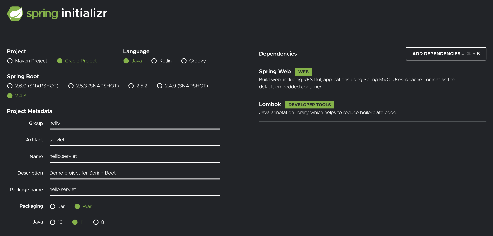
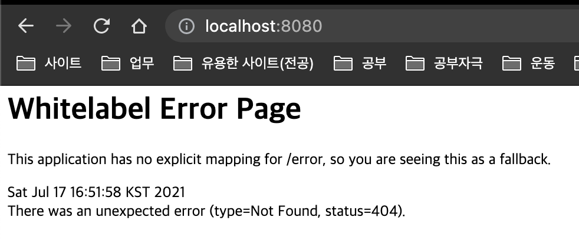
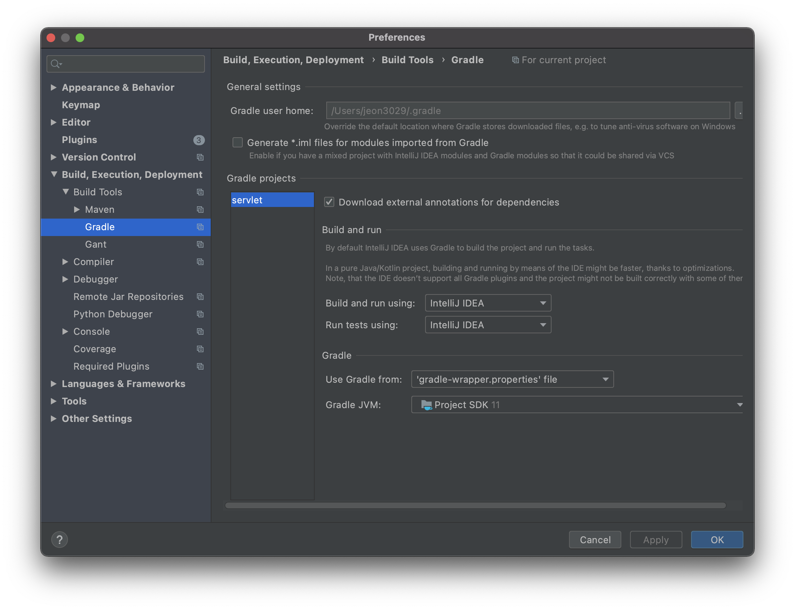

# Spring initializer 사용해서 프로젝트 생성
- spring boot 사용
- [사이트](https://start.spring.io/)

## 사용한 설정
- 
- 세팅완료 이후 서버 동작했을 때(localhost:8080) 다음과 같이 뜨면 정상임
- 

## 추가설정(IntelliJ)
1. gradle 설정을 다음과 같이 변경
    - 
2. plugin 설치
    - plugins > Market Place > lombok 설치
    - build > compile > annotation processors
      - enable annotation processing 설정하기(체크)

## 추가 유틸리니(개발 용이하게 하는 툴)
1. Postman 설치
   - [링크](https://www.postman.com/downloads)