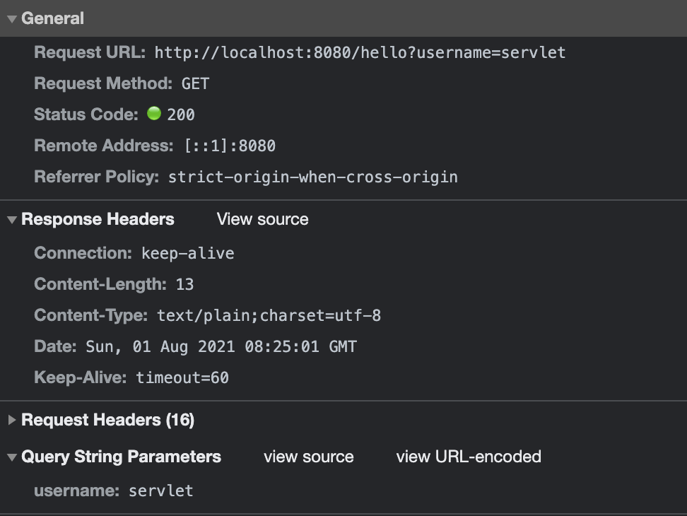
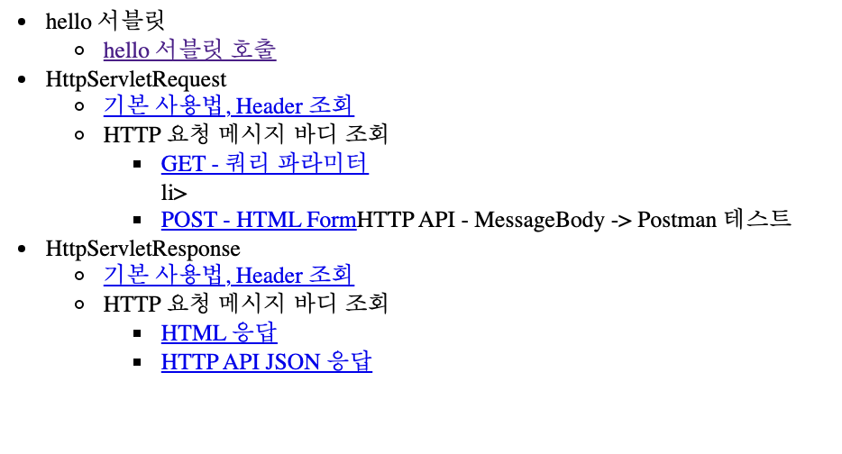

# Servelet 설명

## 스프링부트 서블릿 환경 구성

```java
// 하위 컴포넌트 검색하면서 서블릿 자동 등록
@ServletComponentScan 
@SpringBootApplication
public class Application {
  public static void main(String[] args) {
    SpringApplication.run(Application.class, args);
  }
}
```

## 서블릿 등록

```java
@WebServlet(name="helloServlet",urlPatterns = "/hello")
public class HelloServlet  extends HttpServlet {
    @Override
    protected void service(HttpServletRequest request, HttpServletResponse response) throws ServletException, IOException {
        //Service testing
        //soutm 단축키로 빠르게 타입 가능
        System.out.println("HelloServlet.service");

        //httpServlet Interface
        //soutv 단축키로 빠르게 타입 가능
        System.out.println("response = " + response);
        System.out.println("response = " + response);

        //GET method testing
        //getParameter로 request에서 원하는 정보 추출
        String username = request.getParameter("username");
        System.out.println("username = " + username);

        //인코딩 방식 설정
        response.setContentType("text/plain");
        response.setCharacterEncoding("utf-8");

        response.getWriter().write("hello " + username);
    }
}
```
- 개발자 도구를 통한 요청 정보


## http 요청 메세지 로그 확인

- application.properties 에 다음 설정 추가
```properties
# 운영서버에서는 과부하 원인 가능
logging.level.org.apache.coyote.http11=debug
```
## 간단한 html통해서 ui꾸미기

- webapp/index.html
```html
<!DOCTYPE html>
<html>
<head>
    <meta charset="UTF-8">
    <title>Title</title>
</head>
<body> <ul>
    <li><a href="basic.html">서블릿 basic</a></li> </ul>
</body>
</html>
```

- webapp/basic.html
```html
<!DOCTYPE html>
<html>
<head>
    <meta charset="UTF-8">
    <title>Title</title>
</head>
<body> <ul>
    <li>hello 서블릿
        <ul>
            <li><a href="/hello?username=servlet">hello 서블릿 호출</a></li>
        </ul> </li>
    <li>HttpServletRequest
        <ul>
            <li><a href="/request-header">기본 사용법, Header 조회</a></li> <li>HTTP 요청 메시지 바디 조회
            <ul>
                <li><a href="/request-param?username=hello&age=20">GET -
                    쿼리 파라미터</a></li> li>
                <li><a href="/basic/hello-form.html">POST - HTML Form</a></
                <li>HTTP API - MessageBody -> Postman 테스트</li> </ul>
        </li> </ul>
    </li>
    <li>HttpServletResponse
        <ul>
            <li><a href="/response-header">기본 사용법, Header 조회</a></li> <li>HTTP 요청 메시지 바디 조회
            <ul>
                <li><a href="/response-html">HTML 응답</a></li>
                <li><a href="/response-json">HTTP API JSON 응답</a></li>
            </ul> </li>
        </ul> </li>
</ul>
</body>
</html>
```
- 결과 화면
