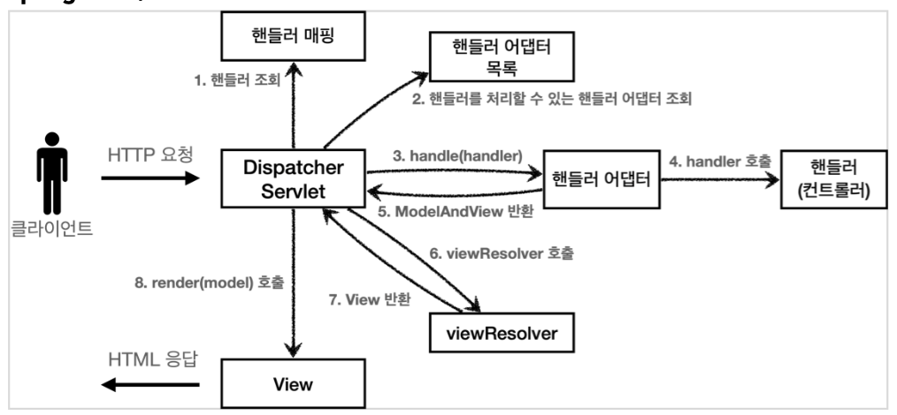

# 중간발표 이어서 두번째 발표(세번째 발표때 마무리 될 듯 함)

## 개요

- Spring MVC 구조
- 실제 현업에서 사용되는 springmvc
  - 로깅
  - Request Mapping
  - Request Parameter
  - Http request(여기까지 준비)
- 아래로는 추후 진행
  - Http response
- Spring mvc 로 웹 페이지 만들기

## Spring MVC 구조

- 직접 만든 MVC 구조


- Spring MVC 구조


사실상 이름 말고는 똑같은 구조이다.

## `DispatcherServlet` 구조 살펴보기

`org.springframework.web.servlet.DispatcherServlet`

- 프론트 컨트롤러 패턴으로 구현되어 있다.
- 디스패처 서블릿이 바로 스프링 MVC의 핵심
- `DispatcherServlet` 도 부모 클래스에서 HttpServlet 을 상속 받아서 사용하고, 서블릿으로 동작함
- `DispatcherServlet` 을 서블릿으로 자동으로 등록하면서 모든 경로( urlPatterns="/" )에 대해서 매핑
- 진짜 똑같나? 코드로 보자

`[DispatcherServlet] doDispatch()`

```java
protected void doDispatch(HttpServletRequest request, HttpServletResponse response) throws Exception {
  HttpServletRequest processedRequest = request;
  HandlerExecutionChain mappedHandler = null;
  ModelAndView mv = null;
  // 1. 핸들러 조회
  mappedHandler = getHandler(processedRequest); 
  if (mappedHandler == null) {
    noHandlerFound(processedRequest, response);
    return; 
  }
  // 2.핸들러 어댑터 조회-핸들러를 처리할 수 있는 어댑터
  HandlerAdapter ha = getHandlerAdapter(mappedHandler.getHandler());
  // 3. 핸들러 어댑터 실행 
  // 4. 핸들러 어댑터를 통해 핸들러 실행 
  // 5. ModelAndView 반환 
  mv = ha.handle(processedRequest, response, mappedHandler.getHandler());
  processDispatchResult(processedRequest, response, mappedHandler, mv, dispatchException);
}
private void processDispatchResult(HttpServletRequest request, HttpServletResponse response, HandlerExecutionChain mappedHandler, ModelAndView mv, Exception exception) throws Exception {
  // 뷰 렌더링 호출
  render(mv, request, response);
}
protected void render(ModelAndView mv, HttpServletRequest request,
HttpServletResponse response) throws Exception {
  View view;
  String viewName = mv.getViewName(); 
  // 6. 뷰 리졸버를 통해서 뷰 찾기
  // 7.View 반환
  view = resolveViewName(viewName, mv.getModelInternal(), locale, request);

  //8. 뷰 렌더링
  view.render(mv.getModelInternal(), request, response);
}
```

### 동작 순서

- Spring MVC 구조


1. 핸들러 조회: 핸들러 매핑을 통해 요청 URL에 매핑된 핸들러(컨트롤러)를 조회한다.
2. 핸들러 어댑터 조회: 핸들러를 실행할 수 있는 핸들러 어댑터를 조회한다.
3. 핸들러 어댑터 실행: 핸들러 어댑터를 실행한다.
4. 핸들러 실행: 핸들러 어댑터가 실제 핸들러를 실행한다.
5. ModelAndView 반환: 핸들러 어댑터는 핸들러가 반환하는 정보를 ModelAndView로 변환해서 반환한다.
6. viewResolver 호출: 뷰 리졸버를 찾고 실행한다.
   - JSP의 경우: InternalResourceViewResolver 가 자동 등록되고, 사용된다.
7. View반환:뷰리졸버는 뷰의 논리이름을 물리이름으로 바꾸고,렌더링역할을 담당하는 뷰객체를 반환한다.
   - JSP의 경우 InternalResourceView(JstlView) 를 반환하는데, 내부에 forward() 로직이 있다.
8. 뷰렌더링: 뷰를 통해서 뷰를 렌더링한다.

### 주요 인터페이스

- 핸들러 매핑: org.springframework.web.servlet.HandlerMapping
- 핸들러 어댑터: org.springframework.web.servlet.HandlerAdapter
- 뷰 리졸버: org.springframework.web.servlet.ViewResolver
- 뷰: org.springframework.web.servlet.View

> - 스프링 MVC의 큰 강점은 DispatcherServlet 코드의 변경 없이, 원하는 기능을 변경하거나 확장할 수 있다는 점이다.
> - 지금까지 설명한 대부분을 확장 가능할 수 있게 인터페이스로 제공한다.
> - 이 인터페이스들만 구현해서 DispatcherServlet 에 등록하면 여러분만의 컨트롤러를 만들 수도 있다

### 정리

- 내부구조를 모두 파악하는것은 쉽지 않지만, 핵심 로직은 단순하다. 전체적인 구조를 이해하자.
- 확장포인트 필요할 때, 문제가 났을 때 도움이 될 것이다.

### 핸들러 매핑과 핸들러

지금은 전혀 사용하지 않지만, 과거에 주로 사용했던 스프링이 제공하는 간단한 컨트롤러로 핸들러 매핑과 어댑터를 이해해보자

- 과거버전 스프링 컨트롤러
- `org.springframework.web.servlet.mvc.Controller`

  ```java
  public interface Controller {
      ModelAndView handleRequest(HttpServletRequest request, HttpServletResponse response) throws Exception;
  }
  ```

  > 현재 사용하는 `@Controller` 와는 전혀 다르다.

- OldController(과거버전 컨트롤러) 구현하기
- [OldController](./servlet/src/main/java/hello/servlet/web/springmvc/old/OldController.java)
  - @Component : 이 컨트롤러는 /springmvc/old-controller 라는 이름의 스프링 빈으로 등록되었다. 빈의 이름으로 URL을 매핑할 것이다.
  - <http://localhost:8080/springmvc/old-controller>
- 이 컨트롤러는 어떻게 호출되는 것일까?
  - 컨트롤러가 호출되려면... 2가지 필요
    - **HandlerMapping(핸들러 매핑)**
      - 핸들러 매핑에서 이 컨트롤러를 찾을 수 있어야 한다.
      - (예) 스프링 빈의 이름으로 핸들러를 찾을 수 있는 핸들러 매핑이 필요하다.  
    - **HandlerAdapter(핸들러 어댑터)**
      - 핸들러 매핑을 통해서 찾은 핸들러를 실행할 수 있는 핸들러 어댑터가 필요하다.
      - (예) Controller 인터페이스를 실행할 수 있는 핸들러 어댑터를 찾고 실행해야 한다

- 스프링 부트가 자동 등록하는 핸들러 매핑과 핸들러 어댑터
  - HandlerMapping
    - 0 = RequestMappingHandlerMapping : 애노테이션 기반의 컨트롤러인 @RequestMapping에서 사용
    - 1 = BeanNameUrlHandlerMapping : 스프링 빈의 이름으로 핸들러를 찾는다.
  - HandlerAdapter
    - 0 = RequestMappingHandlerAdapter : 애노테이션 기반의 컨트롤러인 @RequestMapping에서 사용
    - 1 = HttpRequestHandlerAdapter : HttpRequestHandler 처리
    - 2 = SimpleControllerHandlerAdapter : Controller 인터페이스(애노테이션X, 과거에 사용) 처리
- 지금 경우에는 1,2
  - HandlerMapping = BeanNameUrlHandlerMapping
  - HandlerAdapter = SimpleControllerHandlerAdapter

### HttpRequestHandler

`HttpRequestHandler핸들러(컨트롤러)`는 서블릿과 가장 유사한 형태의 핸들러이다.

```java
public interface HttpRequestHandler {
  void handleRequest(HttpServletRequest request, HttpServletResponse response)throws ServletException, IOException;
}
```

- [MyHttpRequestHandler](./servlet/src/main/java/hello/servlet/web/springmvc/old/MyHttpRequestHandler.java)
  - <http://localhost:8080/springmvc/request-handler>
- 지금 경우에는 1,1
  - HandlerMapping = BeanNameUrlHandlerMapping
  - HandlerAdapter = HttpRequestHandlerAdapter

> `@RequestMapping`
> 가장 우선순위가 높은 핸들러 매핑과 핸들러 어댑터는 `RequestMappingHandlerMapping` ,`RequestMappingHandlerAdapter` 이다
> 실무에서는 99.9% 이 방식의 컨트롤러를 사용한다.

### 뷰 리졸버

기존 `OldController` 변경

[OldController](./servlet/src/main/java/hello/servlet/web/springmvc/old/OldController.java)

```java
return new ModelAndView("new-form");
```

`application.properties` 에 코드 추가

```properties
spring.mvc.view.prefix=/WEB-INF/views/
spring.mvc.view.suffix=.jsp
```

- 스프링 부트는 `InternalResourceViewResolver` 라는 뷰 리졸버를 자동으로 등록하는데, 이때 application.properties 에 등록한 `spring.mvc.view.prefix` , `spring.mvc.view.suffix` 설정 정보를 사용해서 등록한다
  - (권장하는 방식은 아님)다음과 같이 리턴해도 동작함.

  ```java
  return new ModelAndView("/WEB-INF/views/new-form.jsp");
  ```

- 동작 확인
<http://localhost:8080/springmvc/old-controller>

### 스프링부트가 자동등록하는 뷰 리졸버

```text
1 = BeanNameViewResolver : 빈 이름으로 뷰를 찾아서 반환한다. (예: 엑셀 파일 생성 기능에 사용)
2 = InternalResourceViewResolver : JSP를 처리할 수 있는 뷰를 반환한다.
```

- 호출 순서
  1. 핸들러 어댑터 호출
     - `new-form` 논리 뷰 이름 획득
  2. `ViewResolver` 호출
     - `new-form` 이라는 이름으로 viewResolver 호출
     - `BeanNameViewResolver` 는 new-form 이라는 이름의 스프링 빈으로 등록된 뷰를 찾아야 하는데 없다.
     - `InternalResourceViewResolver` 가 호출된다.
  3. InternalResourceViewResolver
  4. InternalResourceView 반환
  5. view.render()
     - forward() -> jsp 실행
     - jsp 제외한 나머지 뷰 템플릿은 forward() 과정 없음

> InternalResourceViewResolver 는 만약 JSTL 라이브러리가 있으면 InternalResourceView 를 상속받은 JstlView 를 반환한다.
> JstlView 는 JSTL 태그 사용시 약간의 부가 기능이 추가된다.

> Thymeleaf 뷰 템플릿을 사용하면 ThymeleafViewResolver 를 등록해야 한다.
> 최근에는 라이브러리만 추가하면 스프링 부트가 이런 작업도 모두 자동화해준다.

### 스프링 MVC - 시작하기

- 스프링이 제공하는 컨트롤러는 애노테이션 기반으로 동작해서, 매우 유연하고 실용적이다.
- 과거에는 자바 언어에 애노테이션이 없기도 했고, 스프링도 처음부터 이런 유연한 컨트롤러를 제공한 것은 아니다.

- `@RequestMapping`
  - `RequestMappingHandlerMapping`
  - `RequestMappingHandlerAdapter`
- 실무에서는 99.9% 이 방식의 컨트롤러를 사용한다.

#### SpringMemberFormControllerV1 - 회원 등록 폼

- [SpringMemberFormControllerV1](./servlet/src/main/java/hello/servlet/web/springmvc/v1/SpringMemberFormControllerV1.java)
  - @Controller :
    - 스프링이 자동으로 스프링 빈으로 등록한다.
      - 내부에 @Component 애노테이션이 있어서 컴포넌트 스캔의 대상이 됨
    - 스프링 MVC에서 애노테이션 기반 컨트롤러로 인식한다.
      - `RequestMappingHandlerMapping` 에서 꺼내 쓸 수 있음
  - @RequestMapping :
    - 요청 정보를 매핑한다. 해당 URL이 호출되면 이 메서드가 호출된다.
    - 애노테이션을 기반으로 동작하기 때문에, 메서드의 이름은 임의로 지으면 된다.
  - ModelAndView :
    - 모델과 뷰 정보를 담아서 반환하면 된다.

- RequestMappingHandlerMapping 은 스프링 빈 중에서  
  - @RequestMapping 또는 @Controller 가 클래스 레벨에 붙어 있는 경우에 매핑 정보로 인식한다.

다음 코드도 동일하게 동작함

```java
@Component //컴포넌트 스캔을 통해 스프링 빈으로 등록 
@RequestMapping
public class SpringMemberFormControllerV1 {
  @RequestMapping("/springmvc/v1/members/new-form")
  public ModelAndView process() {
    return new ModelAndView("new-form");
  }
}
```

다음과 같이 스프링 빈으로 직접 등록해도 동작한다.

```java
@RequestMapping
public class SpringMemberFormControllerV1 {
  @RequestMapping("/springmvc/v1/members/new-form")
  public ModelAndView process() {
    return new ModelAndView("new-form");
  }
}
//ServletApplication
@Bean
SpringMemberFormControllerV1 springMemberFormControllerV1() {
  return new SpringMemberFormControllerV1();
}
```

- 나머지 코드 작성
  - 회원저장
    - [SpringMemberSaveControllerV1](./servlet/src/main/java/hello/servlet/web/springmvc/v1/SpringMemberSaveControllerV1.java)
    - mv.addObject("member", member)
      - 모델 데이터 추가 방식 변화
  - 회원리스트
    - [SpringMemberListControllerV1](./servlet/src/main/java/hello/servlet/web/springmvc/v1/SpringMemberListControllerV1.java)

#### Spring MVC - 컨트롤러 통합 (V2)

- @RequestMapping 을 잘 보면 클래스 단위가 아니라 메서드 단위에 적용된 것을 확인할 수 있다.
- 따라서 컨트롤러 클래스를 유연하게 하나로 통합할 수 있다.
- [SpringMembersControllerV2](./servlet/src/main/java/hello/servlet/web/springmvc/v2/SpringMembersControllerV2.java)
  - 클래스 레벨에 다음과 같이 @RequestMapping 을 두면 메서드 레벨과 조합됨

  ```java
  @Controller
  @RequestMapping("/springmvc/v2/members")
  public class SpringMemberControllerV2 {}
  ```

- 이미 만들어진 컨트롤러를 사용하니 편하긴 하지만, ModelAndView를 만들어 주어야 하는 등 불편한 점이 있다.

#### Spring MVC - 실용적인 방식 V3 (기존 front controller V3 -> V4로의 진화)

- 실무에서는 지금부터 설명하는 방식을 주로 사용한다.
- [SpringMemberControllerV3](./servlet/src/main/java/hello/servlet/web/springmvc/v3/SpringMemberControllerV3.java)
  - Model 파라미터
  save() , members() 를 보면 Model을 파라미터로 받는 것을 확인할 수 있다. 스프링 MVC도 이런 편의 기능을 제공한다.
  - ViewName 직접 반환
  뷰의 논리 이름을 반환할 수 있다.
  - @RequestParam 사용
  @ RequestParam("username") 은 request.getParameter("username") 와 거의 같은 코드
  GET 쿼리 파라미터, POST Form 방식을 모두 지원한다.
  - @RequestMapping @GetMapping, @PostMapping
  Get, Post, Put, Delete, Patch 모두 애노테이션이 있음


----
지금까지 spring mvc 구조를 살펴보았고 지금부터 실무에서 사용하는 spring mvc에대해서 알아보자
----

## Spring initializer 사용해서 프로젝트 생성

- spring boot 사용
- <https://start.spring.io/>

### 사용한 설정


- 프로젝트 선택
  - Project: Gradle Project
  - Language: Java
  - Spring Boot: 2.4.x
- Project Metadata 
  - Group: hello
  - Artifact: springmvc
  - Name: springmvc
  - Package name: hello.springmvc 
  - Packaging: Jar (주의!)
  - Java: 11
- Dependencies
  - Spring Web, Thymeleaf, Lombok

> Packaging는 War가 아니라 Jar를 선택
> Jar를 사용하면 항상 내장 서버(톰캣등)을 사용하고, webapp 경로도 사용하지 않음
> 내장 서버 사용에 최적화 되어 있는 기능, 최근에는 주로 이 방식을 사용
>> War를 사용하면 내장 서버도 사용가능 하지만, 주로 외부 서버에 배포하는 목적

### 프로젝트 동작 확인

- <http://localhost:8080>


### Welcome page 만들기

- /resources/static/index.hml
- [index.html](./springmvc/src/main/resources/static/index.html)

> 참고
> <https://docs.spring.io/spring-boot/docs/current/reference/html/features.html#features.developing-web-applications.spring-mvc.welcome-page>

## (참고)로깅 알아보기

- 운영시스템에서는 sysout 사용하지 않는다

### 로깅 라이브러리

- 스프링 부트 라이브러리를 사용하면 스프링 부트 로깅 라이브러리 `spring-boot-starter-logging`가 함께 포함된다
  - SLF4J : <http://www.slf4j.org>
  - Logback : <http://logback.qos.ch>
- 로그 라이브러리는 Logback, Log4J, Log4J2 등등 수 많은 라이브러리가 있는데, 그것을 통합해서 인터페이스로 제공하는 것이 바로 SLF4J 라이브러리
  - 실무에서는 스프링 부트가 기본으로 제공하는 Logback을 대부분 사용

----

### 로그 선언 및 호출

```java
//선언
private Logger log = LoggerFactory.getLogger(getClass());
private static final Logger log = LoggerFactory.getLogger(Xxx.class)

//lombok
@Slf4j

//호출
log.info("hello");
```

- [LogTestController](./springmvc/src/main/java/hello/springmvc/basic/LogTestController.java)
  - LEVEL : TRACE > DEBUG > INFO > WARN > ERROR
  - 개발 서버는 debug 출력
  - 운영 서버는 info 출력

- [application.properties](./springmvc/src/main/resources/application.properties)

- 올바른 사용법
  - `log.debug("data="+data");`
    - 로깅레벨이 debug 보다 높을 때에도 문자 더하기 연산이 수행됨(출력이 안되어도)
  - `log.debug("data = {},data);`
    - 의미없는 연산 발생하지 않음

### 로그 사용시 장점

- 쓰레드 정보, 클래스 이름 같은 `부가 정보`를 함께 볼 수 있고, 출력 모양을 조정할 수 있다.
- `로그 레벨`에 따라 개발 서버에서는 모든 로그를 출력하고, 운영서버에서는 출력하지 않는 등 로그를 상황에 맞게 조절할 수 있다.
- 시스템 아웃 콘솔에만 출력하는 것이 아니라, 파일이나 네트워크 등, 로그를 `별도의 위치`에 남길 수 있다. 특히 파일로 남길 때는 일별, 특정 용량에 따라 로그를 분할하는 것도 가능하다.
- `성능`도 일반 System.out보다 좋다. (내부 버퍼링, 멀티 쓰레드 등등) 그래서 실무에서는 꼭 로그를 사용해야 한다.

> 참고
> <https://docs.spring.io/spring-boot/docs/current/reference/html/spring-boot-features.html#boot-features-logging>

----
## 요청매핑

### 코드로 보는 요청매핑

- [MappingController](./springmvc/src/main/java/hello/springmvc/basic/requestmapping/MappingController.java)
- 기본 설정
  - @RestController
    - @Controller 는 반환 값이 String 이면 뷰 이름으로 인식
    - @RestController 는 반환 값으로 뷰를 찾는 것이 아니라, HTTP 메시지 바디에 바로 입력
  - @RequestMapping("/hello-basic")
    - 대부분의 속성을 배열[] 로 제공하므로 다중 설정이 가능하다. `{"/hello-basic", "/hello-go"}`
  - @RequestMapping
    - method 속성으로 HTTP 메서드를 지정하지 않으면 HTTP 메서드와 무관하게 호출된다.
    - GET, HEAD, POST, PUT, PATCH, DELETE 모두 허용 
  - 참고
    - URL 요청: /hello-basic , /hello-basic/
    - 위 두가지는 다르지만, 스프링에서는 같은 요청으로 매핑됨
- mapping-get-v1
  - method를 설정해두면 post등 다른 방식은 허용하지 않는다
- mapping-get-v2
  - 만들어진 어노테이션 활용
- pathvariable(경로변수)
  - 최근 HTTP API는 다음과 같이 리소스 경로에 식별자를 넣는 스타일을 선호
  - (예) `/users/1`
  - @PathVariable 의 이름과 파라미터 이름이 같으면 생략할 수 있다.
- pathvariavla(다중)
  - 다중으로 사용 가능
- 특정 파라미터 조건 매핑
  - `params = "mode=debug"`
  - mode가 없으면 호출이 안됨
  - !=, {여러개 조건..} 등 사용가능
- 특정 헤더로 추가 매핑
  - 헤더가 없으면 호출이 안됨
  - 파라미터와 마찬가지로 헤더가 없을때 등 커스터마이징 가능
- Content-Type 헤더 기반 추가 매핑 Media Type : `consume`
  - Content-Type 헤더를 기반으로 미디어 타입으로 매핑
  - 만약 맞지 않으면 HTTP 415 상태코드(Unsupported Media Type)을 반환
- 미디어 타입 조건 매핑 - HTTP 요청 Accept : `produce`
  - 
  - HTTP 요청의 Accept 헤더를 기반으로 미디어 타입으로 매핑
  - 만약 맞지 않으면 HTTP 406 상태코드(Not Acceptable)을 반환

### 요청매핑 - API 예시

- [MappingClassController](./springmvc/src/main/java/hello/springmvc/basic/requestmapping/MappingClassController.java)

----

# Http 요청

## Http 요청 - 기본, 헤더 조회

- 지난번 HttpServletRequest 에서도 헤더정보 뽑는것을 했었다.
- 바로 코드로 알아보자.
- [RequestHeaderController](./springmvc/src/main/java/hello/springmvc/basic/request/RequestHeaderController.java)
- `HttpServletRequest`
- `HttpServletResponse`
- HttpMethod : HTTP 메서드를 조회한다. org.springframework.http.HttpMethod
- Locale : locale 정보 조회
- @RequestHeader MultiValueMap<String, String> headerMap
  - 모든 HTTP 헤더를 MultiValueMap 형식으로 조회한다.
  - @RequestHeader("host") String host
    - 특정 HTTP 헤더를 조회한다. 속성
    - 필수 값 여부: required
    - 기본 값 속성: defaultValue
- @CookieValue(value = "myCookie", required = false) String cookie
  - 특정 쿠키를 조회한다.
    - 필수 값 여부: required
    - 기본 값: defaultValue
- MultiValueMap
  - 하나의 키에 여러 값 받을 수 있음
  - `List<String> values = map.get("keyA");`
> @Controller 참고
> <https://docs.spring.io/spring-framework/docs/current/reference/html/web.html#mvc-ann-arguments>
> <https://docs.spring.io/spring-framework/docs/current/reference/html/web.html#mvc-ann-return-types>

## Http 요청 파라미터 - 쿼리 파라미터, HTML Form

- Http 요청 메세지를 통해 데이터를 전송하는 방법
  - GET - 쿼리 파라미터
    - /url?username=hello&age=20
    - 메시지 바디 없이, URL의 쿼리 파라미터에 데이터를 포함해서 전달
    - (예) 검색, 필터, 페이징등에서 많이 사용하는 방식
  - POST - HTML Form
    - content-type: application/x-www-form-urlencoded
    - 메시지 바디에 쿼리 파리미터 형식으로 전달 username=hello&age=20
    - (예) 회원 가입, 상품 주문, HTML Form 사용
  - HTTP message body에 데이터를 직접 담아서 요청
    - HTTP API에서 주로 사용, JSON, XML, TEXT
    - 데이터 형식은 주로 JSON 사용
    - POST, PUT, PATCH

- 여기서 GET 쿼리방식, POST Html Form 방식이 요청파라미터 조회 방식이다.

- 코드로 알아보자
- [RequestParamController](./springmvc/src/main/java/hello/springmvc/basic/request/RequestParamController.java)
  - request-param-v1 : HttpServletRequest
    - Test :
      - GET : <http://localhost:8080/request-param-v1?username=hello&age=20>
      - POST Form : [hello-form.html](./servlet/src/main/webapp/basic/hello-form.html)
  - request-param-v2 : @Requestparam
    - requestparam 사용하여 간편하게 사용
    - @ResponseBody : string 을 http body 에 넣어서 보내줌
  - request-param-v3
    - 변수명이 같으면 생략가능
  - request-param-v4
    - 더 간단하게도 가능
    - 너무 없으면 과하다는 (주관적인) 생각 / @Requestparam 은 명확하게 요청 파리미터에서 데이터를 읽는 다는 것을 알 수 있다
  - /request-param-required
    - required로 필수값 설정
    - /request-param?username=
      - 빈문자도 가능 : null 과 "" 의 차이
  - /request-param-default
    - defaultValue 설정
    - 기본값이 있는경우, required 는 의미가 없음
    - "" 의 경우에도 defaultValue 로 설정됨
  - /request-param-map
    - paramMap 형태로도 조회 가능
  - @ModelAttribute 형태(객체로 바로 받기)
    - [HelloData](./servlet/src/main/java/hello/servlet/basic/HelloData.java)
    - /model-attribute-v1
      - 스프링MVC는 @ModelAttribute 가 있으면 다음을 실행한다.
        - HelloData 객체를 생성한다.
        - 요청 파라미터의 이름으로 HelloData 객체의 프로퍼티를 찾는다. 그리고 해당 프로퍼티의 setter를 호출해서 파라미터의 값을 입력(바인딩) 한다.
        - (예) 파라미터 이름이 username 이면 setUsername() 메서드를 찾아서 호출하면서 값을 입력한다.
      - (참고) 프로퍼티
        - 객체에 getUsername() , setUsername() 메서드가 있으면, 이 객체는 username 이라는 프로퍼티를 가지고 있다.
      - (참고) 바인딩 오류
        - age=abc 처럼 숫자가 들어가야 할 곳에 문자를 넣으면 BindException 이 발생한다. 이런 바인딩 오류를 처리하는 방법은 **검증 부분**(추후 다룰예정)에서 다룬다.
    - /model-attribute-v2
      - @ModelAttribute 생략가능
      - 생략시, String , int , Integer 같은 단순 타입 = @RequestParam
      - 나머지 = @ModelAttribute (argument resolver 로 지정해둔 타입 외)