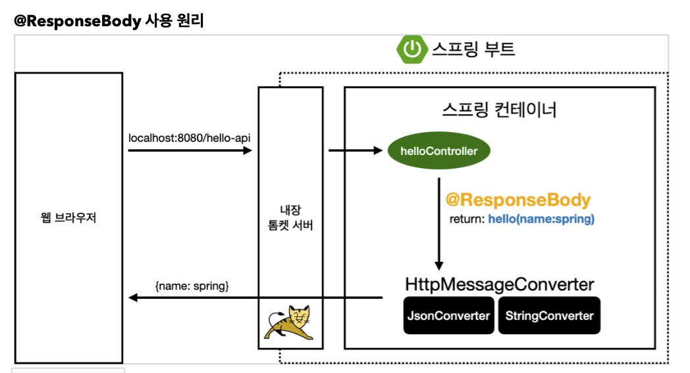
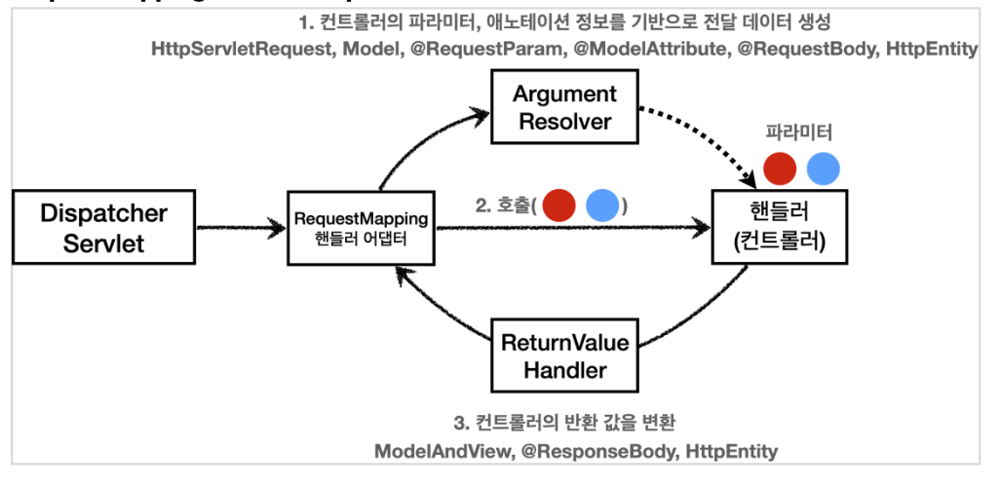
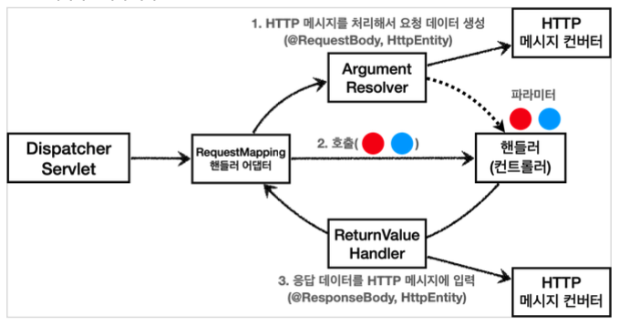
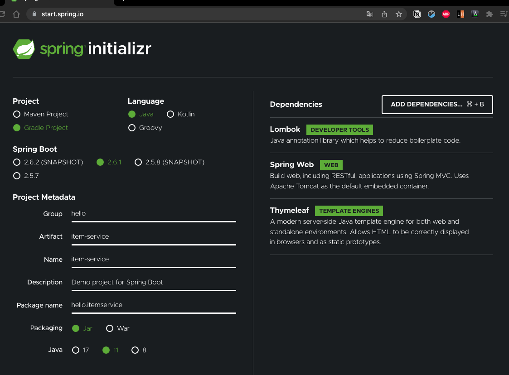
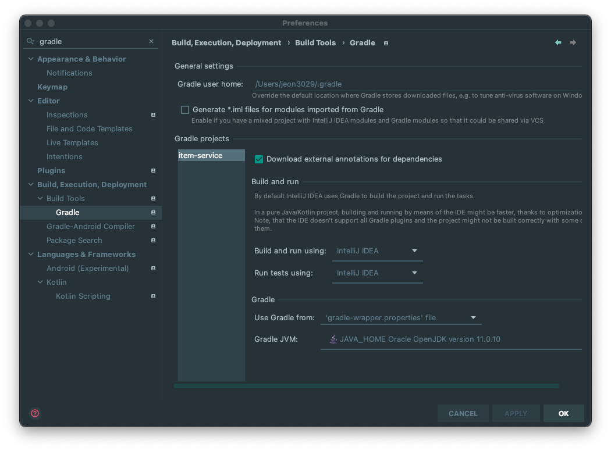
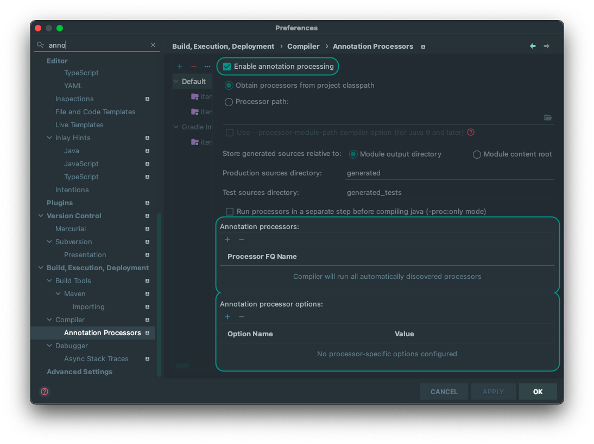
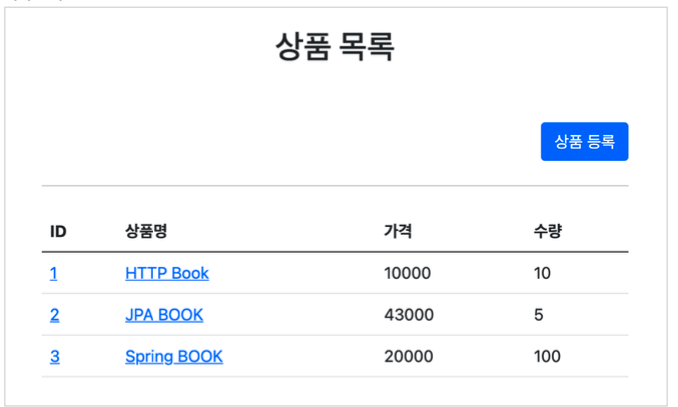
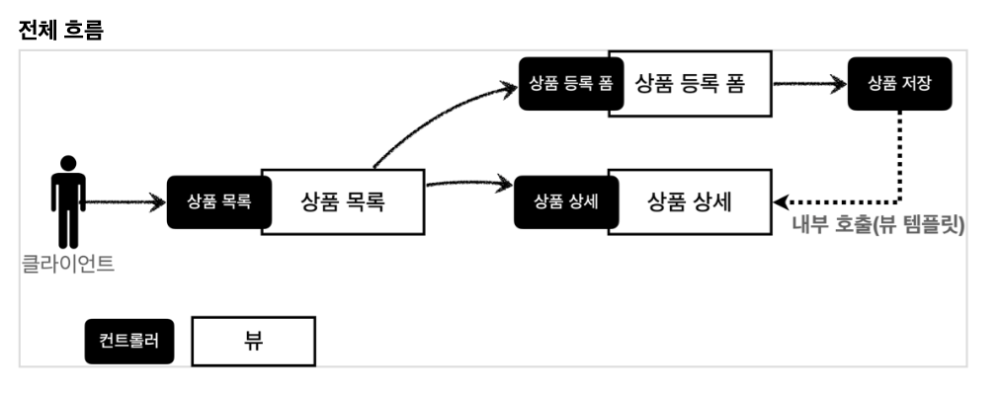
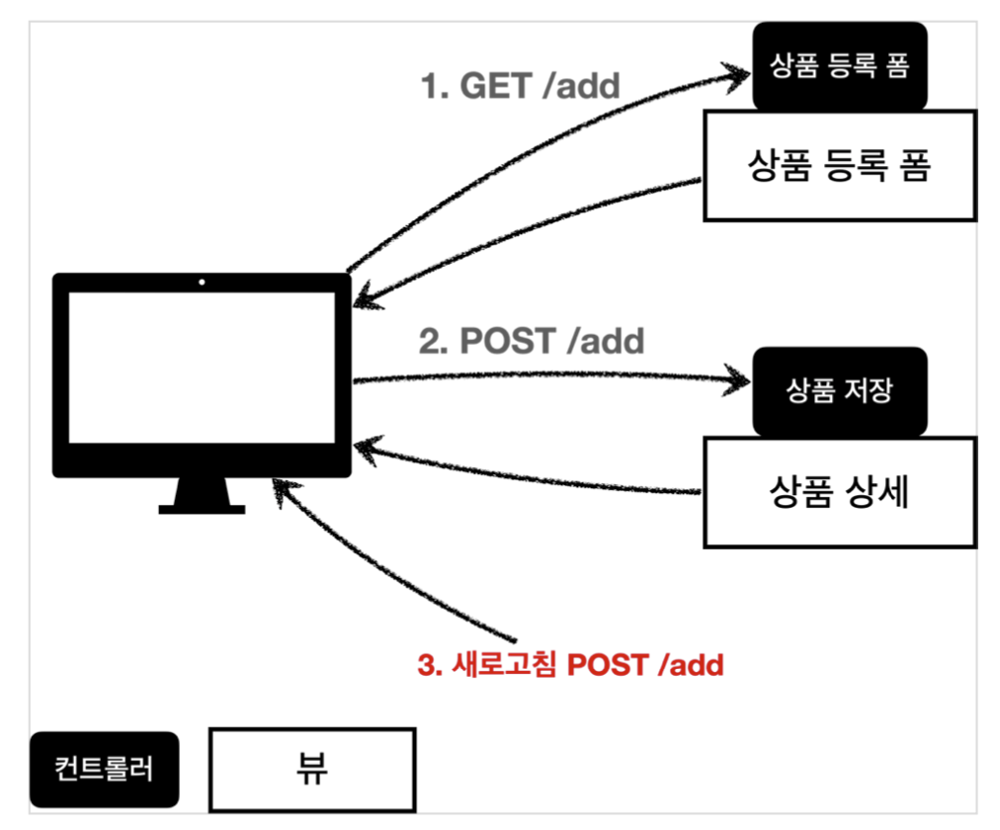
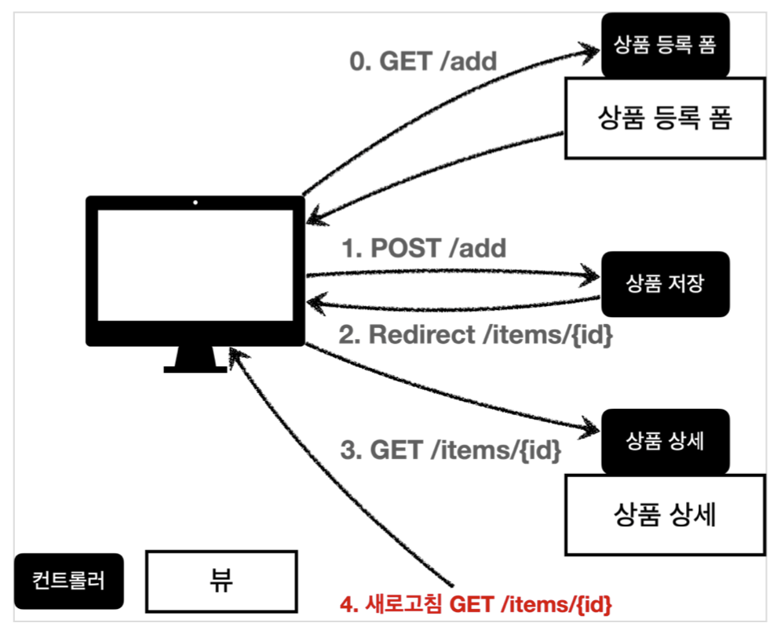

# 세번째 발표 : SpringMVC 마무리

- Http 요청
  - Http 요청 파라미터 - 단순 텍스트
  - Http 요청 메세지 - json
- Http response
  - Http 응답 : 정적리소스, 뷰 템플릿
  - HTTP 응답 - 메시지 바디, 상태코드
- Http 메시지 컨버터 및 동작 원리
  - Http 메시지 컨버터
  - Request Mapping Handler Adapter 구조 및 동작 과정(컨버터 동작 포함)
- Spring mvc 로 웹 페이지 만들기
  - 요구사항 분석 및 개발 과정

## Http 요청 파라미터 - 단순 텍스트

- HTTP message body에 데이터를 직접 담아서 요청
  - HTTP API에서 주로 사용, JSON, XML, TEXT
  - 데이터 형식은 주로 JSON 사용
  - POST, PUT, PATCH
  - Body 를 통해 데이터가 직접 데이터가 넘어오는 경우는 `@RequestParam` , `@ModelAttribute` 를 사용할 수 없다.

- [RequestBodyStringController](./springmvc/src/main/java/hello/springmvc/basic/request/RequestBodyStringController.java)
  - /request-body-string-v1
    - HTTP 메시지 바디의 데이터를 InputStream 을 사용해서 직접 읽음
    - 인코딩방식 설정 후 출력
  - /request-body-string-v2
    - 스프링 MVC는 다음 파라미터를 지원한다.
      - InputStream(Reader): HTTP 요청 메시지 바디의 내용을 직접 조회
      - OutputStream(Writer): HTTP 응답 메시지의 바디에 직접 결과 출력
  - /request-body-string-v3
    - `HttpEntity` : HTTP header, body 정보를 편리하게 조회
    - `HttpEntity` 는 응답에도 사용 가능
    - `HttpEntity`의 상속객체
      - `RequestEntity`
        - HttpMethod, url 정보가 추가, 요청에서 사용
      - `ResponseEntity`
        - HTTP 상태 코드 설정 가능, 응답에서 사용
    - 내부적으로 HttpMessageConverter 사용 -> StringHttpMessageConverter 적용
  - /request-body-string-v4
    - @RequestBody 를 사용하면 HTTP 메시지 바디 정보를 편리하게 조회할 수 있다.
      - 참고로 헤더 정보가 필요하다면 HttpEntity 를 사용하거나 @RequestHeader 를 사용하면 된다.
    - @ResponseBody 를 사용하면 응답 결과를 HTTP 메시지 바디에 직접 담아서 전달할 수 있다.
      - 물론 이 경우에도 view를 사용하지 않는다.

## Http 요청 메세지 - json

- http api 에서 주로 사용하는 형식
- [RequestBodyJsonController](./springmvc/src/main/java/hello/springmvc/basic/request/RequestBodyJsonController.java)
- /request-body-json-v1
  - objectMapper 직접 사용
- /request-body-json-v2
  - @RequestBody
    - HttpMessageConverter 사용 -> StringHttpMessageConverter 적용
  - @ResponseBody
    - 메시지 바디 정보 직접 반환(view 조회X)
- /request-body-json-v3
  - `HttpEntity` , `@RequestBody` 를 사용하면 HTTP 메시지 컨버터가 HTTP 메시지 바디의 내용을 우리가 원하는 문자나 객체 등으로 변환해줌
  - @RequestBody는 생략 불가능
    - 생략하면 @ModelAttribute 로 취급
    > @ModelAttribute , @RequestParam 해당 생략시 다음과 같은 규칙을 적용
    > - String , int , Integer 같은 단순 타입 = @RequestParam
    > - 나머지 = @ModelAttribute (argument resolver 로 지정해둔 타입 외)
- /request-body-json-v4
  - `HttpEntity` 방식
- /request-body-json-v5
  - 응답의 경우도 객체를 바디에 직접 넣을 수 있음
  - Accept 헤더에 따름
  - @RequestBody 요청
    - JSON 요청 HTTP 메시지 컨버터 객체
  - @ResponseBody 응답
    - 객체 HTTP 메시지 컨버터 JSON 응답


# Http 응답

## Http 응답 : 정적리소스, 뷰 템플릿

스프링(서버)에서 응답 데이터를 만드는 방법은 크게 3가지이다.

- 정적 리소스
  - 웹 브라우저에 정적인 HTML, css, js을 제공할 때는, 정적 리소스를 사용한다.
- 뷰 템플릿 사용
  - 웹 브라우저에 동적인 HTML을 제공할 때는 뷰 템플릿을 사용한다.
- HTTP 메시지 사용
  - HTTP API를 제공하는 경우에는 HTML이 아니라 데이터를 전달해야 하므로, HTTP 메시지 바디에 JSON 같은 형식으로 데이터를 실어 보낸다.

### 정적 리소스

- 스프링 부트는 클래스패스의 다음 디렉토리에 있는 정적 리소스를 제공한다.
  - /static , /public , /resources , /META-INF/resources
  - (예) src/main/resources/static/basic/hello-form.html
    - <http://localhost:8080/basic/hello-form.html>
    - 해당 url 로 접근 가능

### 뷰 템플릿

- 뷰 템플릿 경로
  - src/main/resources/templates
- 뷰 템플릿 생성
  - src/main/resources/templates/response/hello.html
  - [hello.html](./springmvc/src/main/resources/templates/response/hello.html)
- 컨드롤러 작성 : [ResponseViewController](./springmvc/src/main/java/hello/springmvc/basic/response/ResponseViewController.java)
  - @ResponseBody 가 없으면 response/hello 로 뷰 리졸버가 실행되어서 뷰를 찾고, 렌더링 한다.
  - `void`를 반환하는 경우
    - @Controller 를 사용하고, HttpServletResponse , OutputStream(Writer) 같은 HTTP 메시지바디를 처리하는 파라미터가 없으면 요청 URL을 참고해서 논리 뷰 이름으로 사용
      - **권장하지 않는다.**

### Thymeleaf 스프링 부트 설정

이미 설정되어 있지만(<https://start.spring.io/>) 추가 설정 필요할 경우 위하여 참고
`build.gradle`

```gradle
`implementation 'org.springframework.boot:spring-boot-starter-thymeleaf'`
```

기본 설정값(변경 필요할 때만 설정)
`application.properties`

```properties
spring.thymeleaf.prefix=classpath:/templates/
spring.thymeleaf.suffix=.html
```

공식 문서
> <https://docs.spring.io/spring-boot/docs/2.4.3/reference/html/appendix-application-properties.html#common-application-properties-templating>

## HTTP 응답 - 메시지 바디, 상태코드

HTTP 요청에서 응답까지 대부분 다루었지만 정리하는 목적
- 정적 리소스나 뷰템플릿을 거치지 않고 바로 전달하는 경우

- [ResponseBodyController](./springmvc/src/main/java/hello/springmvc/basic/response/ResponseBodyController.java)
- responseBodyV1
  - HttpServletResponse 객체를 통해서 HTTP 메시지 바디에 직접 ok 응답 메시지를 전달한다.
- responseBodyV2
  - ResponseEntity 엔티티는 HttpEntity 를 상속 받았는데, HttpEntity는 HTTP 메시지의 헤더, 바디 정보를 가지고 있다. ResponseEntity 는 여기에 더해서 HTTP 응답 코드를 설정할 수 있다.
- responseBodyV3
  - @ResponseBody 를 사용하면 view를 사용하지 않고, HTTP 메시지 컨버터를 통해서 HTTP 메시지를 직접 입력할 수 있다. ResponseEntity 도 동일한 방식으로 동작한다.
- responseBodyJsonV1
  - ResponseEntity 를 반환한다. HTTP 메시지 컨버터를 통해서 JSON 형식으로 변환되어서 반환된다.
- responseBodyJsonV2
  - ResponseEntity 는 HTTP 응답 코드를 설정할 수 있는데, @ResponseBody 를 사용하면 이런 것을 설정하기 까다롭다.
  - @ResponseStatus(HttpStatus.OK) 애노테이션을 사용하면 응답 코드도 설정할 수 있다.
  - 동적으로 응답코드 설정하고 싶다면, `ResponseEntity` 사용하면 된다.

# Http 메시지 컨버터 및 동작 원리

## Http 메시지 컨버터

뷰 템플릿으로 HTML을 생성해서 응답하는 것이 아니라, HTTP API처럼 JSON 데이터를 HTTP 메시지
바디에서 직접 읽거나 쓰는 경우 HTTP 메시지 컨버터를 사용하면 편리함

httpconverter 설명하기 앞서서...

`@ResponseBody` 사용 원리


- HTTP의 BODY에 문자 내용을 직접 반환
- viewResolver 대신에 HttpMessageConverter 가 동작
- 기본 문자처리: `StringHttpMessageConverter`
- 기본 객체처리: `MappingJackson2HttpMessageConverter`
- byte 처리 등등 기타 여러 `HttpMessageConverter`가 기본으로 등록되어 있음

**스프링 MVC는 다음의 경우에 HTTP 메시지 컨버터를 적용한다.**

- HTTP 요청: @RequestBody , HttpEntity(RequestEntity)
- HTTP 응답: @ResponseBody , HttpEntity(ResponseEntity)

`org.springframework.http.converter.HttpMessageConverter`

```java
package org.springframework.http.converter;
    public interface HttpMessageConverter<T> {
      boolean canRead(Class<?> clazz, @Nullable MediaType mediaType);
      boolean canWrite(Class<?> clazz, @Nullable MediaType mediaType);
      List<MediaType> getSupportedMediaTypes();
      T read(Class<? extends T> clazz, HttpInputMessage inputMessage)
              throws IOException, HttpMessageNotReadableException;
      void write(T t, @Nullable MediaType contentType, HttpOutputMessage
    outputMessage)
              throws IOException, HttpMessageNotWritableException;
}
```

- canRead() , canWrite() : 메시지 컨버터가 해당 클래스, 미디어타입을 지원하는지 체크
  - 클래스타입, 미디어 타입 두가지 모두 체크
- read() , write() : 메시지 컨버터를 통해서 메시지를 읽고 쓰는 기능

스프링 부트 기본 메시지 컨버터

```text
0 = ByteArrayHttpMessageConverter
1 = StringHttpMessageConverter
2 = MappingJackson2HttpMessageConverter
```

- ByteArrayHttpMessageConverter : byte[] 데이터를 처리한다.
  - 클래스 타입: byte[] , 미디어타입: \*/* ,
  - 요청 예) @RequestBody byte[] data
  - 응답 예) @ResponseBody return byte[] 쓰기 미디어타입 application/octet-stream
- StringHttpMessageConverter : String 문자로 데이터를 처리한다.
  - 클래스 타입: String , 미디어타입: \*/*
  - 요청 예) @RequestBody String data
  - 응답 예) @ResponseBody return "ok" 쓰기 미디어타입 text/plain
- MappingJackson2HttpMessageConverter : application/json
  - 클래스 타입: 객체 또는 HashMap , 미디어타입 application/json 관련
  - 요청 예) @RequestBody HelloData data
  - 응답 예) @ResponseBody return helloData 쓰기 미디어타입 application/json 관련

1. `StringHttpMessageConverter`

```java
content-type: application/json
@RequestMapping
void hello(@RequetsBody String data) {}
```

2. `MappingJackson2HttpMessageConverter`

```java
content-type: application/json
@RequestMapping
void hello(@RequetsBody HelloData data) {}
```

3. `X(에러)`

```java
content-type: text/html
@RequestMapping
void hello(@RequetsBody HelloData data) {}
```

- HTTP 요청 데이터 읽기
  - HTTP 요청이 오고, 컨트롤러에서 @RequestBody , HttpEntity 파라미터를 사용한다. 메시지 컨버터가 메시지를 읽을 수 있는지 확인하기 위해 canRead() 를 호출한다.
    - 대상 클래스 타입을 지원하는가.
      - 예) @RequestBody 의 대상 클래스 ( byte[] , String , HelloData )
    - HTTP 요청의 Content-Type 미디어 타입을 지원하는가.
      - 예) text/plain , application/json , \*/*
  - canRead() 조건을 만족하면 read() 를 호출해서 객체 생성하고, 반환한다.

- HTTP 응답 데이터 생성
  - 컨트롤러에서 @ResponseBody , HttpEntity 로 값이 반환된다.
  - 메시지 컨버터가 메시지를 쓸 수 있는지 확인하기 위해 canWrite() 를 호출한다.
    - 대상 클래스 타입을 지원하는가.
      - 예) return의 대상 클래스 ( byte[] , String , HelloData )
    - HTTP 요청의 Accept 미디어 타입을 지원하는가.(더 정확히는 @RequestMapping 의 produces )
      - 예) text/plain , application/json , \*/*
  - canWrite() 조건을 만족하면 write() 를 호출해서 HTTP 응답 메시지 바디에 데이터를 생성한다.

## Request Mapping Handler Adapter 구조 및 동작 과정(컨버터 동작 포함)

- spring mvc 구조


- 어디에서 메세지 컨버터가 호출되고 동작하는걸까?
  - 모든 과정이 @RequestMapping 을 처리하는 핸들러 어댑터인 `RequestMappingHandlerAdapter` (요청 매핑 헨들러 어뎁터)에 있다

- RequestMappingHandlerAdapter 동작 방식
- 

### ArgumentResolver

- `RequestMappingHandlerAdaptor` 줄여서 ArgumentResolver
- `ArgumentResolver` 가 HttpServletRequest ,Model 은 물론이고, @RequestParam , @ModelAttribute 같은 애노테이션 그리고 @RequestBody , HttpEntity 같은 HTTP 메시지까지 유연하게 처리를 해 준다.
- RequestMappingHandlerAdaptor 는 ArgumentResolver 를 호출해서 컨트롤러가 필요로 하는 다양한 파라미터 값을 생성하고 넘겨준다.
- 30개가 넘는 ArgumentResolver 제공

> 공식문서
> <https://docs.spring.io/spring-framework/docs/current/reference/html/web.html#mvc-ann-arguments>

`HandlerMethodArgumentResolver`

```java
public interface HandlerMethodArgumentResolver {
      boolean supportsParameter(MethodParameter parameter);
@Nullable
      Object resolveArgument(MethodParameter parameter, @Nullable
    ModelAndViewContainer mavContainer,
              NativeWebRequest webRequest, @Nullable WebDataBinderFactory
    binderFactory) throws Exception;
}
```

- HandlerMethodArgumentResolver 의 구현체를 보면 얼마나 많은지 알 수 있음.
- ArgumentResolver 의 supportsParameter() 를 호출해서 해당 파라미터를 지원하는지 체크하고, 지원하면 resolveArgument() 를 호출해서 실제 객체를 생성
- 인터페이스로 설계외어 있어서 기능을 확장하기 쉬움
  - 커스텀 하게 ArgumentResolver 를 만들수 있음

### ReturnValueHandler

- `HandlerMethodReturnValueHandler` 를 줄여서 `ReturnValueHandle`
- 컨트롤러에서 String으로 뷰 이름을 반환해도, 동작하는 이유가 바로 ReturnValueHandler 덕분
  - 코드로 확인
- 10여개가 넘는 ReturnValueHandler 를 지원

> 공식 문서
> <https://docs.spring.io/spring-framework/docs/current/reference/html/web.html#mvc-ann-return-types>

### HttpMessageConverter



- 요청의 경우 @RequestBody 를 처리하는 ArgumentResolver 가 있고, HttpEntity 를 처리하는 ArgumentResolver 가 있다. 이 ArgumentResolver 들이 HTTP 메시지 컨버터를 사용해서 필요한 객체를 생성
- 응답의 경우 @ResponseBody 와 HttpEntity 를 처리하는 ReturnValueHandler 가 있다. 그리고 여기에서 HTTP 메시지 컨버터를 호출해서 응답 결과를 만듦
- 예) @RequestBody @ResponseBody 가 있으면
  - RequestResponseBodyMethodProcessor(ArgumentResolver)
- 예) HttpEntity 가 있으면
  - HttpEntityMethodProcessor(ArgumentResolver)

### 확장

모두 인터페이스로 제공 -> 언제든지 확장 가능

- HandlerMethodArgumentResolver
- HandlerMethodReturnValueHandler
- HttpMessageConverter

- 실제 기능확장하는 경우는 많지 않음...
- 하지만, 필요한 경우 기능 확장은 `WebConfigurer` 를 상속받아서 스프링 빈으로 등록하는 방식

```java
@Bean
public WebMvcConfigurer webMvcConfigurer() {
  return new WebMvcConfigurer() {
    @Override
    public void addArgumentResolvers(List<HandlerMethodArgumentResolver>
resolvers) {
  ////
    }
    @Override
    public void extendMessageConverters(List<HttpMessageConverter<?>>
    converters) {
    //...
    }
  };
}
```

- 실제 사용방식은 필요할 때 검색하서 알아보자

# 웹페이지 만들기 - 프로젝트 생성 및 요구사항

## 프로젝트 생성

- <https://start.spring.io>

- configs
  - 
  - 
- [index.html](./item-service/src/main/resources/static/index.html)
- 스프링 부트 실행 후 정상동작 확인

## 요구사항 분석

상품을 관리할 수 있는 서비스를 만들어보자.

- 상품 도메인 모델
  - 상품 ID
  - 상품명
  - 가격
  - 수량
- 상품 관리 기능
  - 상품 목록
  - 상품 상세
  - 상품 등록
  - 상품 수정

### 서비스 화면

- 상품 목록



- 상품 상세


### 서비스 제공 흐름


- 일반적인 개발 형태
  - 디자이너: 요구사항에 맞도록 디자인하고, 디자인 결과물을 웹 퍼블리셔에게 넘김
  - 웹 퍼블리셔: 다자이너에서 받은 디자인을 기반으로 HTML, CSS를 만들어 개발자에게 제공
  - 백엔드 개발자: 디자이너, 웹 퍼블리셔를 통해서 HTML 화면이 나오기 전까지 시스템을 설계하고, 핵심 비즈니스 모델을 개발한다. 이후 HTML이 나오면 이 HTML을 뷰 템플릿으로 변환해서 동적으로 화면전환 및 흐름을 제어

# 개발 진행

## 도메인 개발

- [Item](./item-service/src/main/java/hello/itemservice/domain/item/Item.java)
- [ItemRepository](./item-service/src/main/java/hello/itemservice/domain/item/ItemRepository.java)
- [ItemRepositoryTest](./item-service/src/test/java/hello/itemservice/domain/item/ItemRepositoryTest.java)

## 상품서비스 HTML

- HTML을 편리하게 개발하기 위해 부트스트랩 사용
  - 부트스트랩 공식 사이트: <https://getbootstrap.com>
- 부트스트랩을 다운로드 받고 압축을 풀자.
5.0/getting-started/download/>
  - Compiled CSS and JS 항목을 다운로드하자.
- 압축을 출고 bootstrap.min.css 를 복사해서 다음 폴더에 추가하자
  - resources/static/css/bootstrap.min.css

- [item](./item-service/src/main/resources/static/html/item.html)
- [items](./item-service/src/main/resources/static/html/items.html)
- [addForm](./item-service/src/main/resources/static/html/addForm.html)
- [editForm](./item-service/src/main/resources/static/html/editForm.html)

- 여기서는 웹 퍼블리셔가 있다는 전제하에 구체적인 문법 등은 다루지 않는다.(이해만 하면 됨)

> 정적 리소스가 공개되는 /resources/static 폴더에 HTML을 넣어두면, 실제 서비스에서도 공개된다.
> 서비스를 운영한다면 지금처럼 공개할 필요없는 HTML을 두는 것은 주의!

## 상품목록 - thymeleaf

- [BasicItemController](./item-service/src/main/java/hello/itemservice/web/basic/BasicItemController.java)
  - 컨트롤러 로직은 itemRepository에서 모든 상품을 조회한 다음에 모델에 담는다. 그리고 뷰 템플릿을 호출한다.
  - `@RequiredArgsConstructor`
    - final 이 붙은 멤버변수만 사용해서 생성자를 자동으로 만들어준다.
    - 생성자가 딱 1개만 있으면 스프링이 해당 생성자에 @Autowired 로 의존관계를 주입
    - 따라서 final 키워드를 빼면 안된다
  - `@PostConstruct`
    - 해당 빈의 의존관계가 모두 주입되고 나면 초기화 용도로 호출
    - 한 번만 호출되는 것이 보장됨

- [items_thymeleaf](./item-service/src/main/resources/templates/basic/items.html)
  - 타임리프 사용 선언
    - ```<html xmlns:th="http://www.thymeleaf.org">```
  - 속성 변경 : `th:href`
    - th:href="@{/css/bootstrap.min.css}"
    - href="value1" 을 th:href="value2" 의 값으로 변경한다.
    - 타임리프 뷰 템플릿을 거치게 되면 원래 값을 th:xxx 값으로 변경한다. 만약 값이 없다면 새로 생성한다. HTML을 그대로 볼 때는 href 속성이 사용되고, 뷰 템플릿을 거치면 th:href 의 값이 href 로 대체되면서 동적으로 변경할 수 있다.
    - 대부분의 HTML 속성을 th:xxx 로 변경할 수 있다
  - 타임리프 핵심
    - 핵심은 th:xxx 가 붙은 부분은 서버사이드에서 렌더링 되고, 기존 것을 대체한다. th:xxx 이 없으면 기존 html의 xxx 속성이 그대로 사용된다.
    - HTML을 파일로 직접 열었을 때, th:xxx 가 있어도 웹 브라우저는 th: 속성을 알지 못하므로 무시한다. 따라서 HTML을 파일 보기를 유지하면서 템플릿 기능도 할 수 있다.
      - 이부분은 직접 파일 열어서 시연
  - URL 링크 표현식 - @{...}, th:href="@{/css/bootstrap.min.css}"
    - @{...} : 타임리프는 URL 링크를 사용하는 경우 @{...} 를 사용한다. 이것을 URL 링크 표현식이라 한다.
    - URL 링크 표현식을 사용하면 서블릿 컨텍스트를 자동으로 포함한다.
  - 상품 등록 폼으로 이동 속성 변경 : th:onclick
    - onclick="location.href='addForm.html'"
    - th:onclick="|location.href='@{/basic/items/add}'|"
    - 여기에는 다음에 설명하는 리터럴 대체 문법이 사용되었다. 자세히 알아보자.
  - 리터럴 대체 - |...|
    - |...| :이렇게 사용한다.
    - 타임리프에서 문자와 표현식 등은 분리되어 있기 때문에 더해서 사용해야 한다.
      - ```<span th:text="'Welcome to our application, ' + ${user.name} + '!'">```
    - 다음과 같이 리터럴 대체 문법을 사용하면, 더하기 없이 편리하게 사용할 수 있다.
      - ```<span th:text="|Welcome to our application, ${user.name}!|">```
    - 결과를 다음과 같이 만들어야 하는데 
      - `location.href='/basic/items/add'`
    - 그냥 사용하면 문자와 표현식을 각각 따로 더해서 사용해야 하므로 다음과 같이 복잡해진다. 
      - th:onclick="'location.href=' + '\'' + @{/basic/items/add} + '\''"
    - 리터럴 대체 문법을 사용하면 다음과 같이 편리하게 사용할 수 있다. 
      - th:onclick="|location.href='@{/basic/items/add}'|"
  - 반복 출력 - th:each
    - ```<tr th:each="item : ${items}">```
    - 반복은 th:each 를 사용한다. 이렇게 하면 모델에 포함된 items 컬렉션 데이터가 item 변수에 하나씩 포함되고, 반복문 안에서 item 변수를 사용할 수 있다.
    - 컬렉션의 수 만큼 <tr>..</tr> 이 하위 테그를 포함해서 생성된다.
  - 변수 표현식 - ${...}
    - ```<td th:text="${item.price}">10000</td>```
    - 모델에 포함된 값이나, 타임리프 변수로 선언한 값을 조회할 수 있다. 프로퍼티 접근법을 사용한다. ( item.getPrice() )
  - 내용 변경 - th:text
    - ```<td th:text="${item.price}">10000</td>```
    - 내용의 값을 th:text 의 값으로 변경한다.
    - 여기서는 10000을 ${item.price} 의 값으로 변경한다.
  - URL 링크 표현식2 - @{...}, th:href="@{/basic/items/{itemId}(itemId=${item.id})}"
    - 상품 ID를 선택하는 링크를 확인해보자.
    - URL 링크 표현식을 사용하면 경로를 템플릿처럼 편리하게 사용할 수 있다.
    - 경로 변수( {itemId} ) 뿐만 아니라 쿼리 파라미터도 생성한다.
    - (예) th:href="@{/basic/items/{itemId}(itemId=${item.id}, query='test')}"
      - 생성 링크: <http://localhost:8080/basic/items/1?query=test>
  - URL 링크 간단히 
    - th:href="@{|/basic/items/${item.id}|}"
    - 상품 이름을 선택하는 링크를 확인해보자.
    - 리터럴 대체 문법을 활용해서 간단히 사용할 수도 있다.

> 참고
> 타임리프는 순수 HTML을 파일을 웹 브라우저에서 열어도 내용을 확인할 수 있고, 서버를 통해 뷰 템플릿을 거치면 동적으로 변경된 결과를 확인할 수 있다. 
> JSP를 생각해보면, JSP 파일은 웹 브라우저에서 그냥 열면 JSP 소스코드와 HTML이 뒤죽박죽 되어서 정상적인 확인이 불가능하다. 오직 서버를 통해서 JSP를 열어야 한다.
> 이렇게 순수 HTML을 그대로 유지하면서 뷰 템플릿도 사용할 수 있는 타임리프의 특징을 `네츄럴 템플릿 (natural templates)`이라 한다.

## 상품 상세(item)

- [BasicController](./item-service/src/main/java/hello/itemservice/web/basic/BasicItemController.java) 에 추가
  - @GetMapping("/{itemId}")

- [item_thymeleaf](./item-service/src/main/resources/templates/basic/item.html)
  - 속성 변경
    - th:value th:value="${item.id}"
  - 모델에 있는 item 정보를 획득하고 프로퍼티 접근법으로 출력한다. ( item.getId() ) 
  - value 속성을 th:value 속성으로 변경한다.
  - 상품수정 링크
    - th:onclick="|location.href='@{/basic/items/{itemId}/edit(itemId=${item.id})}'|"
  - 목록으로 링크
    - th:onclick="|location.href='@{/basic/items}'|"

## 상품 등록

- [BasicController](./item-service/src/main/java/hello/itemservice/web/basic/BasicItemController.java) 에 추가
  - GetMapping("/add")
- [addform_thymeleaf](./item-service/src/main/resources/templates/basic/addForm.html)
  - 속성 변경 : `th:action`
  - HTML form에서 action 에 값이 없으면 현재 URL에 데이터를 전송한다.
  - 상품 등록 폼의 URL과 실제 상품 등록을 처리하는 URL을 똑같이 맞추고 HTTP 메서드로 두 기능을 구분한다.
    - 상품 등록 폼: GET /basic/items/add
    - 상품 등록 처리: POST /basic/items/add
    - 이렇게 하면 하나의 URL로 등록 폼과, 등록 처리를 깔끔하게 처리할 수 있다.
  - 취소
    - 취소시 상품 목록으로 이동한다. 
    - th:onclick="|location.href='@{/basic/items}'|

### 상품 등록(@ModelAttribute 다양한 방법)

- [BasicController](./item-service/src/main/java/hello/itemservice/web/basic/BasicItemController.java)
  - post 로 다음 정보를 전달
  - content-type: application/x-www-form-urlencoded
  - 메시지 바디에 쿼리 파리미터 형식으로 전달 
    - ex) itemName=itemA&price=10000&quantity=10
  - addItemV1
    - 먼저 @RequestParam String itemName : itemName 요청 파라미터 데이터를 해당 변수에 받는다.
    - Item 객체를 생성하고 itemRepository 를 통해서 저장한다.
    - 저장된 item 을 모델에 담아서 뷰에 전달한다.
  - addItemV2
    - @ModelAttribute - 요청 파라미터 처리
    - @ModelAttribute 는 Item 객체를 생성하고, 요청 파라미터의 값을 프로퍼티 접근법(setXxx)으로 입력해준다.
    - 바로 모델(Model)에 @ModelAttribute 로 지정한 객체를 자동으로 넣어준다
      - 따라서 addAttribute 는 생략 가능.
        (ex)
        ```java
        @ModelAttribute("hello") //Item item 이름을 hello 로 지정 
        model.addAttribute("hello", item); //모델에 hello 이름으로 저장
        ```
  - addItemV3
    - @ModelAttribute 의 이름을 생략할 수 있음
      - 클래스의 첫글자만 소문자로 변경해서 등록
        (ex)
        - Item item
        - HelloWorld helloWorld
  - addItemV4
    - @ModelAttribute 자체도 생략가능
    - 대상 객체는 모델에 자동 등록된다. 나머지 사항은 기존과 동일

## 상품 수정(editForm)

- [BasicController](./item-service/src/main/java/hello/itemservice/web/basic/BasicItemController.java)
  - 상품 수정 폼
    - @GetMapping("/{itemId}/edit") 추가
  - 상품 수정
    - @PostMapping("/{itemId}/edit") 추가
    - 마지막에 redirect 호출함
      - 스프링은 redirect:/... 으로 편리하게 리다이렉트를 지원한다.
      - 컨트롤러에 매핑된 @PathVariable 의 값은 redirect 에도 사용 할 수 있다.
        - redirect:/basic/items/{itemId} {itemId} 는 @PathVariable Long itemId 의 값을 그대로 사용한다.

> 참고 <br>
> HTML Form 전송은 PUT, PATCH를 지원하지 않는다. GET, POST만 사용할 수 있다.
> PUT, PATCH는 HTTP API 전송시에 사용
> 스프링에서 HTTP POST로 Form 요청할 때 히든 필드를 통해서 PUT, PATCH 매핑을 사용하는 방법이 있지만(가능하지만, 권장 X), HTTP 요청상 POST 요청이다.
> - 자세한 내용은 html form put, delete 등으로 검색하면 알아볼 수 있음

- [editform_thymeleaf](./item-service/src/main/resources/templates/basic/editForm.html)
  - 속성 변경 : `th:action` 은 반복적인 내용이라 설명은 제외한다. 이전 방식과 비슷하다.

## PRG(Post/Redirect/Get)

- 지금까지 작성한 프로그램에는 치명적인 문제가 있다. 무엇일까?
- 상품 등록을 완료하고 웹 브라우저의 새로고침 버튼을 클릭해보자.(addItemV4)
- 상품이 계속해서 중복 등록되는 것을 확인할 수 있다.
  - 
- 왜 그럴까???

- 전체 흐름
- 
- POST 등록 후 새로 고침
- 
  - 웹 브라우저의 새로 고침은 마지막에 서버에 전송한 데이터를 다시 전송한다.
  - 상품 등록 폼에서 데이터를 입력하고 저장을 선택하면 POST /add + 상품 데이터를 서버로 전송한다.
  - 그래서 내용은 같고, ID만 다른 상품 데이터가 계속 쌓이게 된다.

### POST, Redirect GET

- 
  - 새로 고침 문제를 해결하려면 상품 저장 후에 뷰 템플릿으로 이동하는 것이 아니라, 상품 상세 화면으로 리다이렉트를 호출해주면 된다
    - 상품 상세 화면인 GET /items/{id} 가 되는 것
    - addItemV5
  - 이런 문제 해결 방식을 `PRG Post/Redirect/Get` 라 한다.

> 주의
> "redirect:/basic/items/" + item.getId() redirect에서 +item.getId() 처럼 URL에 변수를 더해서 사용하는 것은 URL 인코딩이 안되기 때문에 위험하다. 다음에 설명하는 RedirectAttributes 를 사용하자.

## RedirectAttributes

- 상품 상세 화면에 "저장되었습니다"라는 메시지를 보여달라는 요구사항
- [BasicController](./item-service/src/main/java/hello/itemservice/web/basic/BasicItemController.java)
  - addItemV6
  - 실행해보면 다음과 같은 리다이렉트 결과가 나온다. 
  - <http://localhost:8080/basic/items/3?status=true>
  - `RedirectAttributes`
  - RedirectAttributes 를 사용하면 URL 인코딩도 해주고, pathVarible , 쿼리 파라미터까지 처리
    - redirect:/basic/items/{itemId}
      - pathVariable 바인딩: {itemId}
      - 나머지는 쿼리 파라미터로 처리: ?status=true
- [item_thymeleaf](./item-service/src/main/resources/templates/basic/item.html)
  - th:if : 해당 조건이 참이면 실행