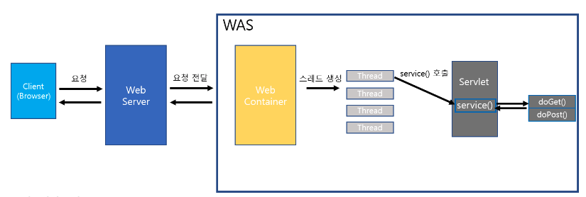
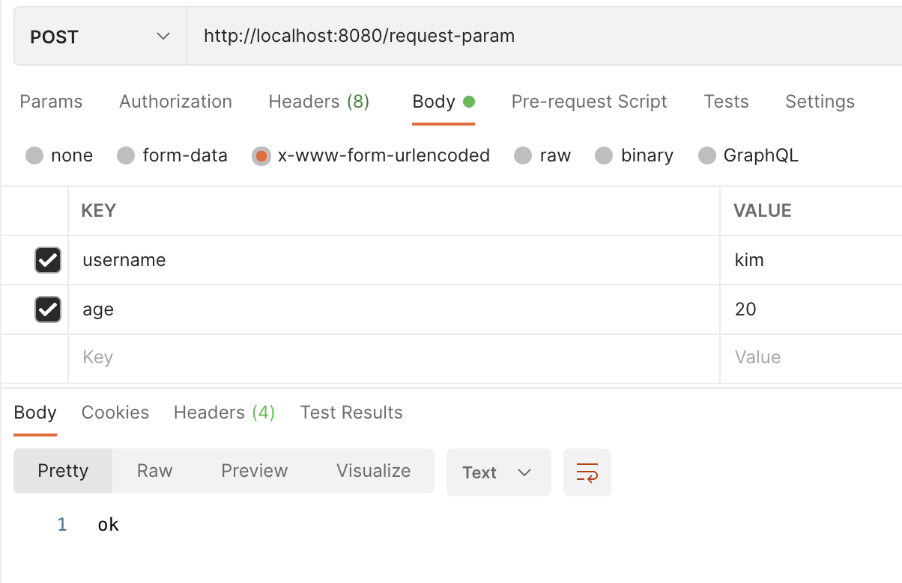
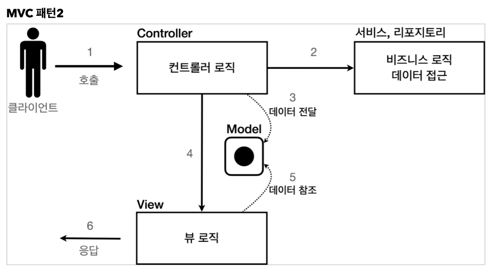
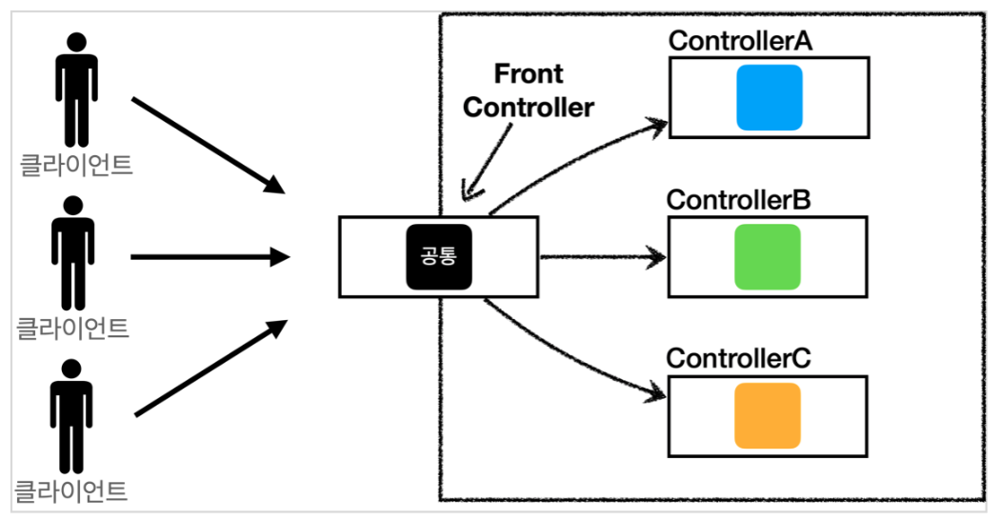
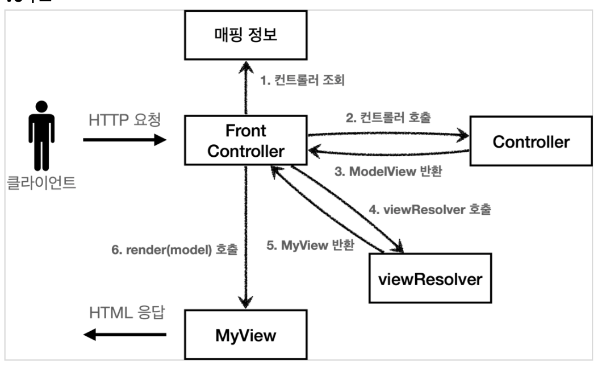
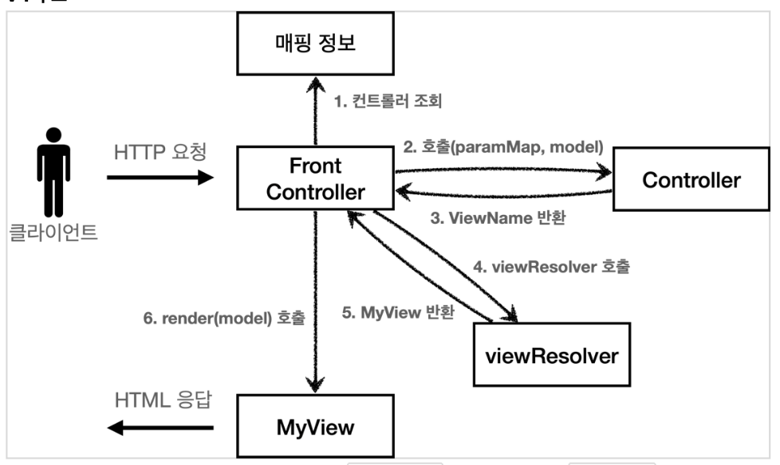
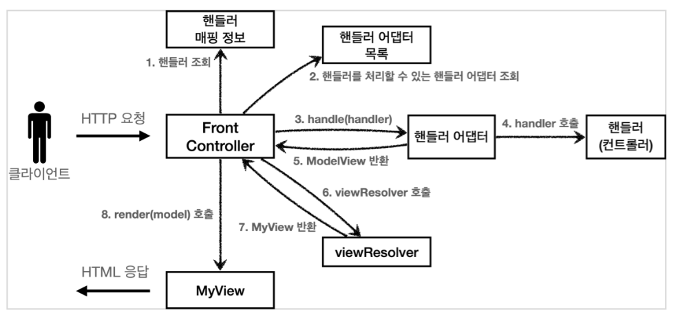

# 중간발표 및 개인 정리 용도

## 개요

- 전반적인 흐름
  - 서블릿 개념
  - 기본적인 웹 서버 어플리케이션
  - 데이터 주고받기 : HttpServletRequest, HttpServletResponse
- 스프링 MVC 이전의 문법 및 MVC 패턴이 나타나게된 원리(불편한 점)
  - 리팩토링하면서 과정을 이해

## 서블릿 개념



- 웹서버에서 동작하는 서비스 페이지로, 웹 브라우저에서 클라이언트의 요청에 따라 서버가 실행하는 자바 프로그램

1. 사용자 요청
   - 사용자가 웹서버에 요청 전달
   - 서블릿 요청일 경우 was 에 전달

2. WebContainer 에서 request, response 객체 생성
   - HttpServletRequest, HttpServletResponse 객체 생성

3. 사용자 요청 처리
   - WebContainer 에서 url 이 어떤 servlet 에 매핑되는지 찾음
   - 이전에 요청된 적 없다면 객체 생성, 해당 servlet의 init() 를 호출하고 메모리에 로드
     - 생성한 적 있다면 객체를 다시 생성하지 않음
   - 사용자 요청을 처리할 Thread 생성
   - 해당 Servlet 의 service() 메소드 실행
   - 사용자 요청에 따라 doGet(), doPost() 메소드 실행.
     - 앞서 생성한 HttpServletRequest, HttpServletResponse를 통해서 인수로 전달받음
4. 응답
   - response객체를 Webcontainer에서 HttpResponse로 바꾸어 Webserver에 전송
5. 소멸
   - request, response 객체 소멸
   - Thread 를 종료

## 기본적인 웹 서버 어플리케이션

- 코드
  - [ServletApplication](./servlet/src/main/java/hello/servlet/Application.java)
  - [HelloServler](./servlet/src/main/java/hello/servlet/basic/HelloServlet.java)
- 실행
  - http://localhost:8080/hello?username=world

- 시스템 출력 로그
  - application.properties 수정
  `logging.level.org.apache.coyote.http11=debug`

## 페이지를 띄우려면?

- http://localhost:8080 에 뜨는 화면
- 코드
  - [index.html](./servlet/src/main/webapp/index.html)
- 추가 구현
  - [basic.html](./servlet/src/main/webapp/basic.html)

## 데이터 주고받기 : HttpServletRequest, HttpServletResponse

### HttpHeader

- Http 요청 메세지
  - Start Line
    - HttpMethod
    - Url
    - 쿼리스트링
    - 스키마, 프로토콜
  - 헤더
    - 헤더조회
  - 바디
    - form 파리미터 조회
    - message body 조회

```text
  POST /save HTTP/1.1
  Host: localhost:8080
  Content-Type: application/x-www-form-urlencoded
  username=kim&age=20
```

- 부가 기능
  - 임시저장소 기능
    - request.setAttribute(name,value)
    - request.getAttribute(name)
  - 세션 관리 기능
    - request.getSession(create:true)

- 코드
  - [RequestHeaderServlet](./servlet/src/main/java/hello/servlet/basic/request/RequestHeaderServlet.java)
  - http://localhost:8080/basic.html 에서 header 조회메뉴

### HttpServletRequest

- 데이터 형식
  - GET
    - 쿼리 파라미터
    - /url?username=hello&age=20
    - 코드
      - [HttpParamServlet](./servlet/src/main/java/hello/servlet/basic/request/RequestParamServlet.java)
      - <http://localhost:8080/request-param?username=hello&age=20>
  - POST
    - content-type: application x-www-form-urlencoded
    - 메시지 바디에 쿼리 파리미터 형식으로 전달 username=hello&age=20
    - [hello-form](./servlet/src/main/webapp/basic/hello-form.html)
    - <http://localhost:8080/basic/hello-form.html>
    - application/x-www-form-urlencoded 형식은 앞서 GET에서 살펴본 쿼리 파라미터 형식과 같다. 따라서 쿼리 파라미터 조회 메서드를 그대로 사용하면 된다.
    - (추가) postman 에서 테스트
    
      - Body x-www-form-urlencoded 선택
      - Headers에서 content-type: application/x-www-form-urlencoded
  - Http message body
    - HTTP API에서 주로 사용, JSON, XML, TEXT
    - [HelloData](./servlet/src/main/java/hello/servlet/basic/HelloData.java)
    - [RequestBodyJson](./servlet/src/main/java/hello/servlet/basic/request/RequestBodyJsonServlet.java)
      - JSON 결과를 파싱해서 사용할 수 있는 자바 객체로 변환하려면 Jackson, Gson 같은 JSON 변환
라이브러리를 추가해서 사용
      - 스프링 부트로 Spring MVC를 선택하면 기본으로 Jackson 라이브러리( ObjectMapper )를 함께 제공

### HttpServletResponse

- 바디 생성
  - 단순 텍스트
    - 앞에서 살펴봄 `writer.println("ok"); )`
  - [api json response 실습코드](./servlet/src/main/java/hello/servlet/basic/response/ResponseJsonServlet.java)
    - json 형식으로 응답
    - content-type 을 application/json 을 지정해야 한다
    - <http://localhost:8080/response-json>
  - [html response 실습코드](./servlet/src/main/java/hello/servlet/basic/response/ResponseHtmlServlet.java)
    - html 형태로 응답
    - <http://localhost:8080/response-html>
- http응답코드 생성
- 헤더 생성
- 편의기능 : Content-Type, 쿠기, Redirect
  - [실습코드 : Header Response](./servlet/src/main/java/hello/servlet/basic/response/ResponseHeaderServlet.java)

---

여기까지가 Http 전반적인 흐름(서블릿 개념, 기본적인 웹 서버 어플리케이션, 데이터 주고받기 : HttpServletRequest, HttpServletResponse) 이었다. 지금부터 간단한 프로젝트를 리팩토링 하며 스프링  mvc 패턴의 등장을 소개한다.

---

## 회원관리 WebApplication

### 요구사항

- 회원정보
  - 이름 : username
  - 나이 : age
- 기능
  - 회원 저장
  - 회원 목록 조회

### 회원 도메인 모델

- [Member](./servlet/src/main/java/hello/servlet/domain/member/Member.java)
- [MemberRepository](./servlet/src/main/java/hello/servlet/domain/member/MemberRepository.java)
  - [MemberRepositoryTest](./servlet/src/test/java/hello/servlet/domain/member/MemberRepositoryTest.java)

### 1. Servlet 으로  회원관리 어플리케이션

- 데이터 저장을 위한 폼
  - [MemberFormServlet](./servlet/src/main/java/hello/servlet/web/servlet/MemberFormServlet.java)
- 저장하기
  - [MemberSaveServlet](./servlet/src/main/java/hello/servlet/web/servlet/MemberSaveServlet.java)
- 전체 목록 테이블로 확인
  - [MemberListServlet](./servlet/src/main/java/hello/servlet/web/servlet/MemberListServlet.java)
- **Refactoring Factor**
  - html 코드를 java 로 작성하는 불편함이 있음 + 가동성이 안좋음
    - html 소스가 길어지게 되면 디버깅이 거의 불가능함
    - 템플릿 엔진 사용으로 html 코드에 java 코드 삽입 가능
      - 대표적인 템플릿 엔진 : jsp, Thymeleaf

### 2. jsp로 회원관리 어플리케이션

- html 소스에 바로 java코드를 삽입할 수 있는 템플릿 엔진인 jsp

#### jsp 사용하기 위해 라이브러리 추가

`build.gradle -> dependences{}`

```gradle
//JSP 추가 시작
implementation 'org.apache.tomcat.embed:tomcat-embed-jasper' 
implementation 'javax.servlet:jstl'
//JSP 추가 끝
```

#### 회원관리 by jsp

- 회원등록
  - [new-form](./servlet/src/main/webapp/jsp/members/new-form.jsp)
- 회원 저장
  - [save](./servlet/src/main/webapp/jsp/members/save.jsp)
- 회원 리스트
  - [members](./servlet/src/main/webapp/jsp/members.jsp)
- **Refactoring Factor**
  - 서블릿으로 작성하는 것보다는 나아졌지만, 비즈니스 로직이 한 파일에 집중되어, 파일이 커지게 되면 상당히 힘들어지게 된다.
  - MVC 패턴이 등장하게 된다
    - 비즈니스 로직은 다른 곳에서 처리하고, jsp는 그리는(html)일에 집중하도록.

### 회원관리 by mvc 패턴

#### mvc 패턴

- MVC 패턴은 지금까지 학습한 것 처럼 하나의 서블릿이나, JSP로 처리하던 것을 컨트롤러(Controller)와 뷰(View)라는 영역으로 서로 역할을 나눈 것을 말한다.
- 웹 애플리케이션은 보통 이 MVC 패턴을 사용



- Model : 뷰에 출력할 데이터를 담아둔다
- View : 모델에 담겨있는 데이터를 활용하여 화면을 그린다.
- Controller : http 요청을 받아서 파라미터 검증 및 비즈니스 로직 실행하고 뷰에 전달할 결과를 조회하여 모델에 담는다
  - 일반적으로 비즈니스 로직은 Service 에 작성한다.
  - MVC 패턴 1은 서비스 영역이 없다.

#### 회원가입 폼

- [MvcMemberFormServlet](./servlet/src/main/java/hello/servlet/web/servletmvc/MvcMemberFormServlet.java)
- `/WEB-INF`
  - 컨트롤러에서만 호출할 수 있음(외부에서 호출 불가능)
  - url/WEB-INF/views/new-form.jsp 와같은 형태로 직접 접근 불가능
- `dispatcher.forward()`
  - 다른 서블릿이나 jsp로 이동
  - 서버내부에서 호출됨

> redirect vs forward
> 리다이렉트는 클라이언트에 응답이 갔다가 다시 요청
> 포워드는 서버 내부적으로 호출되어 사용자가 인식하지 못함

- [new-form.jsp](./servlet/src/main/webapp/WEB-INF/views/new-form.jsp)
- 상대경로로 save 호출함

#### 회원 저장

- 앞의 jsp 로 작성한 코드와 비슷한 형태임
  - jsp 부분 문법 참조(간편하게 사용할 수 있음)
- [MvcMemberSaveServlet](./servlet/src/main/java/hello/servlet/web/servletmvc/MvcMemberSaveServlet.java)
- [save.jsp](./servlet/src/main/webapp/WEB-INF/views/save-result.jsp)

#### 회원 리스트

- 앞의 jsp 로 작성한 코드와 비슷한 형태임
  - tag 활용을 위해서 다음과 같이 선언하고 사용할 수 있음
  
  ```jsp
  <%@ taglib prefix="c" uri="http://java.sun.com/jsp/jstl/core"%>
  <c:forEach var="item" items="${members}">
  <!-- contents -->
  </c:forEach>
  ```

- [MvcMemberListServlet](./servlet/src/main/java/hello/servlet/web/servletmvc/MvcMemberListServlet.java)
- [members.jsp](./servlet/src/main/webapp/WEB-INF/views/members.jsp)

### MVC : 프론트 컨트롤러 만들기 V.1

- 앞서 작성한 mvc 패턴도 중복된 부분, 사용하지 않는 부분, 공통처리 등에 단점이 있었다.
- 이러한 공통 처리를 위해 프론트 컨트롤러가 도입됨
- 프론트 컨트롤러 도입 전

- 프론트 컨트롤러 도입 후


구조적으로 앞단 만들기(인터페이스 활용)
- V.1 구조

- [interface : ContollerV1](./servlet/src/main/java/hello/servlet/web/frontcontroller/v1/ControllerV1.java)
- [MemberFormControllerV1](./servlet/src/main/java/hello/servlet/web/frontcontroller/v1/controller/MemberFormControllerV1.java)
- [MemberSaveControllerV1](./servlet/src/main/java/hello/servlet/web/frontcontroller/v1/controller/MemberSaveControllerV1.java)
- [MemberListControllerV1](./servlet/src/main/java/hello/servlet/web/frontcontroller/v1/controller/MemberListControllerV1.java)
- [FrontControllerServletV1](./servlet/src/main/java/hello/servlet/web/frontcontroller/v1/FrontControllerServletV1.java)

### MVC : 뷰 처리 공통화 V.2

뷰를 처리하는 부분 공통화

```java
  String viewPath = "/WEB-INF/views/new-form.jsp";
  RequestDispatcher dispatcher = request.getRequestDispatcher(viewPath);
  dispatcher.forward(request, response);
```

- V.2 구조


- [Myview](./servlet/src/main/java/hello/servlet/web/frontcontroller/MyView.java)
- [interface : ContollerV2](./servlet/src/main/java/hello/servlet/web/frontcontroller/v2/ControllerV2.java)
- [MemberFormControllerV2](./servlet/src/main/java/hello/servlet/web/frontcontroller/v2/controller/MemberFormControllerV2.java)
- [MemberSaveControllerV2](./servlet/src/main/java/hello/servlet/web/frontcontroller/v2/controller/MemberSaveControllerV2.java)
- [MemberListControllerV2](./servlet/src/main/java/hello/servlet/web/frontcontroller/v2/controller/MemberListControllerV2.java)
- [FrontControllerServletV2](./servlet/src/main/java/hello/servlet/web/frontcontroller/v2/FrontControllerServletV2.java)

### MVC : 모델추가 및 뷰 이름 중복 제거 V.3

모델 추가

- 서블릿 종속성 제거
  - 컨트롤러 입장에서 HttpServletRequest, HttpServletResponse이 꼭 필요할까?
- 뷰 이름 중복 제거
  - /WEB-INF/views/new-form.jsp -> new-form
  - /WEB-INF/views/save-result.jsp -> save-result
  - /WEB-INF/views/members.jsp -> members

- V.3 구조


- [Modelview](./servlet/src/main/java/hello/servlet/web/frontcontroller/ModelView.java)
  - 뷰의 이름과 뷰를 렌더링할 때 필요한 model 객체 : 뷰에 필요한 데이터를 key, value로 넣어주면 됨
- [interface : ContollerV3](./servlet/src/main/java/hello/servlet/web/frontcontroller/v3/ControllerV3.java)
  - 이 컨트롤러는 서블릿 기술을 전혀 사용하지 않는다
  - HttpServletRequest가 제공하는 파라미터는 프론트 컨트롤러가 paramMap에 담아서 호출해주면 됨
- [MemberFormControllerV3](./servlet/src/main/java/hello/servlet/web/frontcontroller/v3/controller/MemberFormControllerV3.java)
  - 논리적인 이름을 제공. frontcontroller 에서 물리 이름으로 변환(viewResolver)
- [MemberSaveControllerV3](./servlet/src/main/java/hello/servlet/web/frontcontroller/v3/controller/MemberSaveControllerV3.java)
  - parameter 정보 paramMap에 있음
- [MemberListControllerV3](./servlet/src/main/java/hello/servlet/web/frontcontroller/v3/controller/MemberListControllerV3.java)
- [FrontControllerServletV3](./servlet/src/main/java/hello/servlet/web/frontcontroller/v3/FrontControllerServletV3.java)
  - `createParamMap()`
    - HttpServletRequest에서 파라미터 정보를 꺼내서 Map으로 변환한다. 그리고 해당 `Map(paramMap)`을 컨트롤러에 전달하면서 호출한다.
  - `viewResolver`
    - 컨트롤러가 반환한 논리 뷰 이름을 실제 물리 뷰 경로로 변경
- [Myview](./servlet/src/main/java/hello/servlet/web/frontcontroller/MyView.java)
  - Myview 일부 수정
    - render부분에 Map 추가
    - jsp 에서는 `request.setAttribute`로 저장해야 `jsp` 파일에서 편리하게 호출할 수 있음

- V3로의 전환은 상속과 다형성, 람다표현식등 많은 내용을 다루고 있어서 이해하기 어려울 수 있다.

### 논리이름으로 모델 적용 V.4

앞서 만든 v3 컨트롤러는 서블릿 종속성을 제거하고 뷰 경로의 중복을 제거하는 등, 잘 설계된 컨트롤러이다.
하지만,

```text
- 항상 ModelView 객체를 생성하고 반환해야 하는 부분이 조금은 번거롭다.
  - 좋은 프레임워크는 아키텍처도 중요하지만, 그와 더불어 실제 개발하는 개발자가 단순하고 편리하게 사용할 수 있어야 한다
- v3를 조금 변경해서 실제 구현하는 개발자들이 매우 편리하게 개발할 수 있는 v4 버전 만들기
```

- V.4 구조

- 기본적인 구조는 V3와 같다. 대신에 컨트롤러가 `ModelView` 를 반환하지 않고, `ViewName` 만 반환한다.
- [interface : ContollerV4](./servlet/src/main/java/hello/servlet/web/frontcontroller/v4/ControllerV4.java)
- [MemberFormControllerV4](./servlet/src/main/java/hello/servlet/web/frontcontroller/v4/controller/MemberFormControllerV4.java)
  - 정말 단순하게 new-form 이라는 뷰의 논리 이름만 반환하면 된다.
- [MemberSaveControllerV4](./servlet/src/main/java/hello/servlet/web/frontcontroller/v4/controller/MemberSaveControllerV4.java)
  - 모델이 파라미터로 전달되기 때문에, 모델을 직접 생성하지 않아도 된다.
- [MemberListControllerV4](./servlet/src/main/java/hello/servlet/web/frontcontroller/v4/controller/MemberListControllerV4.java)
- [FrontControllerServletV4](./servlet/src/main/java/hello/servlet/web/frontcontroller/v4/FrontControllerServletV4.java)

- 기존 구조에서 모델을 파라미터로 넘기고, 뷰의 논리 이름을 반환한다는 작은 아이디어를 적용했을 뿐인데, 컨트롤러를 구현하는 개발자 입장에서 보면 이제 군더더기 없는 코드를 작성할 수 있다
- 프레임워크나 공통 기능이 수고로워야 사용하는 개발자가 편리해진다.

### 유연한 컨트롤러 V.5

한 프로젝트 내에서 서로 다른 방식의 컨트롤러를 사용하고 싶다면 어떨까?

```java
public interface ControllerV3 {
        ModelView process(Map<String, String> paramMap);
}
public interface ControllerV4 {
        String process(Map<String, String> paramMap, Map<String, Object> model);
}
```

```text
- 현 v4 구조에서는 프론트 컨트롤러는 한가지 컨트롤러만 사용할 수 있음
- 이를 위해 어댑터 패턴을 적용하여 다양한 컨트롤러를 처리할 수 있도록 변경
```

- V.5 구조

  - 핸들러 어댑터: 중간에 어댑터 역할을 하는 어댑터가 추가되었는데 이름이 핸들러 어댑터이다. 여기서 어댑터 역할을 해주는 덕분에 다양한 종류의 컨트롤러를 호출할 수 있다.
  - 핸들러: 컨트롤러의 이름을 더 넓은 범위인 핸들러로 변경했다. 그 이유는 이제 어댑터가 있기 때문에 꼭 컨트롤러의 개념 뿐만 아니라 어떠한 것이든 해당하는 종류의 어댑터만 있으면 다 처리할 수 있기 때문이다.

- [interface : MyHandlerAdapter](./servlet/src/main/java/hello/servlet/web/frontcontroller/v5/MyHandlerAdapter.java)
  - `boolean supports(Object handler)`
    - handler는 컨트롤러를 말한다.
    - 어댑터가 해당 컨트롤러를 처리할 수 있는지 판단하는 메서드
  - `ModelView handle(HttpServletRequest request, HttpServletResponse response, Object handler)`
    - 어댑터는 실제 컨트롤러를 호출하고, 그 결과로 ModelView를 반환
    - 실제 컨트롤러가 ModelView를 반환하지 못하면, 어댑터가 ModelView를 직접 생성해서라도 반환
    - 이전에는 프론트 컨트롤러가 실제 컨트롤러를 호출했지만 이제는 이 어댑터를 통해서 실제 컨트롤러가 호출
- [ControllerV3HandlerAdapter](./servlet/src/main/java/hello/servlet/web/frontcontroller/v5/adapter/ControllerV3HandlerAdapter.java)
  - `supports(Object handler)`
    - 처리할 수 있는지 판단
  - `handle()`
    - handler를 컨트롤러 V3로 변환한 다음에 V3 형식에 맞도록 호출한다
- [FrontControllerServlerV5](./servlet/src/main/java/hello/servlet/web/frontcontroller/v5/FrontControllerServletV5.java)
  - 구조 그림을 보면 순서대로 실행하는 것을 알 수 있음
- 여기까지 하면 V3 적용 완료. 다음 코드는 V4 적용과정
  - `initHandlerMappingMap`, `initHandlerAdapters` 수정
  - [ControllerV4HandlerAdapter](./servlet/src/main/java/hello/servlet/web/frontcontroller/v5/adapter/ControllerV4HandlerAdapter.java)
    - V4의경우 ModelView 를 만들어서 반환해야 함
      - viewname 을 modelview 만들어서 반환!

## 마무리 정리

- 여기서 더 발전시키면 좋겠지만, 스프링 MVC의 핵심 구조를 파악하는데 필요한 부분은 모두 만들어보았다.
- 지금까지 작성한 코드는 스프링 MVC 프레임워크의 핵심 코드의 축약 버전이고, 구조도 거의 같다.
