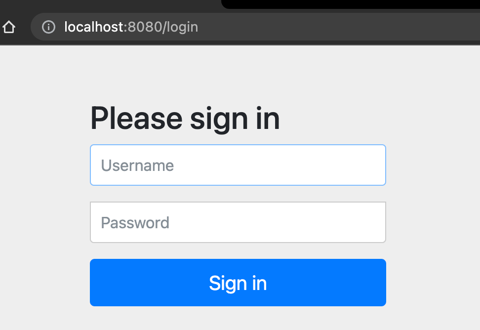

= Security Project 적용
Doc Writer <taejjeon@gmail.com>
:reproducible:
:listing-caption: Source
:source-highlighter: rouge
:toc:
:hardbreaks:

An example of a basic https://asciidoc.org[AsciiDoc] document prepared by {author}.

== Dependency

- 다음 디펜덴시를 적용하면 스프링에 security 가 전역으로 적용이 됨
- 이를 사용자 환경에 맞게 커스텀 해서 사용해야 함.

[source,xml]
----
<dependency>
    <groupId>org.springframework.boot</groupId>
    <artifactId>spring-boot-starter-security</artifactId>
</dependency>
----

== Configuration for Spring Security
다음은 기본 인증을 위한 필터 적용 방법입니다.

- 아래 소스를 보면 기본 인증을 할 때 어떤 configure 가 적용되는지 확인할 수 있음

.WebSecurityConfigurerAdapter
[source,java]
----
protected void configure(HttpSecurity http) throws Exception {
    http
        .authorizeRequests()
            .anyRequest().authenticated()
            .and()
        .formLogin().and()
        .httpBasic();
}
----

- 이를 밖으로 빼서 configure 로 만들어 줌

.SecurityConfig.java
[source,java]
----
@Configuration
@EnableWebSecurity
public class SecurityConfig extends WebSecurityConfigurerAdapter {
	@Override
	protected void configure(HttpSecurity http) throws Exception {
		http
				.authorizeRequests().anyRequest().authenticated()
				.and()
				.formLogin();
	}
}
----

- userid, passwd 따로 설정 가능

.application.properties
[source,properties]
----
spring.security.user.name=user
spring.security.user.password=1234
----

- 세부적인 인증 처리하는 HttpSecurity 가능
.HttpSecurity
[source,markdown]
---
- Authenticate(Confirm user)
```java
http.formLogin()
http.logout()
http.csrf()
http.httpBasic()
http.SessionManagement()
http.RememberMe()
http.ExceptionHandling()
http.addFilter()
```

- Authorize(Give user permission)
```java
http.authorizeRequests()
.antMatchers(/admin)
.hasRole(USER)
.permitAll()
.authenticated()
.fullyAuthentication()
.acess(hasRole(USER))
.denyAll()
```

---