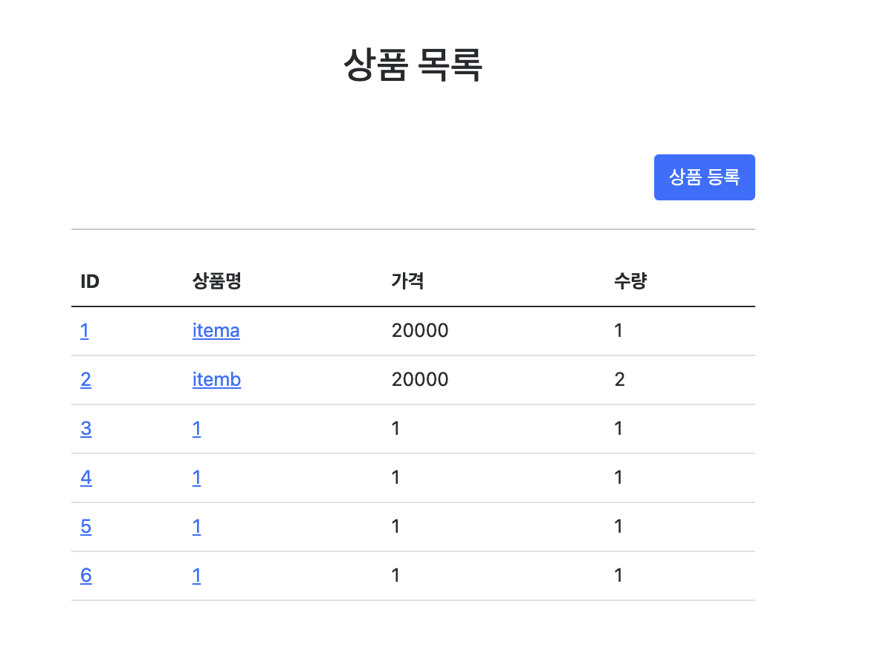
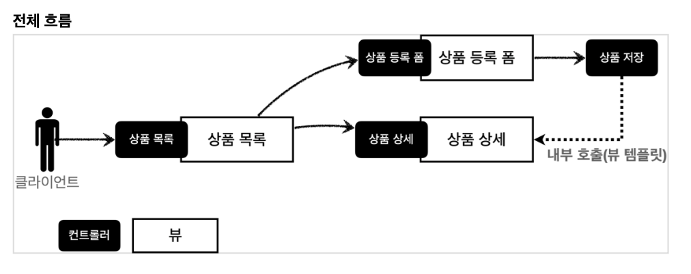
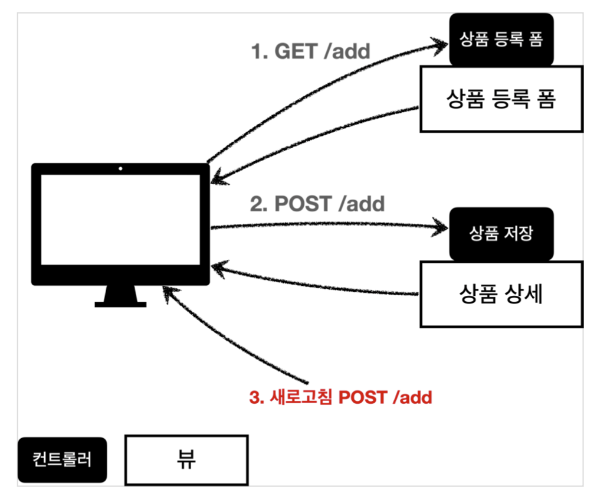

# 개발 진행

## 도메인 개발

- [Item](./item-service/src/main/java/hello/itemservice/domain/item/Item.java)
- [ItemRepository](./item-service/src/main/java/hello/itemservice/domain/item/ItemRepository.java)
- [ItemRepositoryTest](./item-service/src/test/java/hello/itemservice/domain/item/ItemRepositoryTest.java)

## 상품서비스 HTML

- HTML을 편리하게 개발하기 위해 부트스트랩 사용
  - 부트스트랩 공식 사이트: <https://getbootstrap.com>
- 부트스트랩을 다운로드 받고 압축을 풀자.
5.0/getting-started/download/>
  - Compiled CSS and JS 항목을 다운로드하자.
- 압축을 출고 bootstrap.min.css 를 복사해서 다음 폴더에 추가하자
  - resources/static/css/bootstrap.min.css

- [item](./item-service/src/main/resources/static/html/item.html)
- [items](./item-service/src/main/resources/static/html/items.html)
- [addForm](./item-service/src/main/resources/static/html/addForm.html)
- [editForm](./item-service/src/main/resources/static/html/editForm.html)

- 여기서는 웹 퍼블리셔가 있다는 전제하에 구체적인 문법 등은 다루지 않는다.(이해만 하면 됨)

> 정적 리소스가 공개되는 /resources/static 폴더에 HTML을 넣어두면, 실제 서비스에서도 공개된다.
> 서비스를 운영한다면 지금처럼 공개할 필요없는 HTML을 두는 것은 주의!

## 상품목록 - thymeleaf

- [BasicItemController](./item-service/src/main/java/hello/itemservice/web/basic/BasicItemController.java)
  - 컨트롤러 로직은 itemRepository에서 모든 상품을 조회한 다음에 모델에 담는다. 그리고 뷰 템플릿을 호출한다.
  - `@RequiredArgsConstructor`
    - final 이 붙은 멤버변수만 사용해서 생성자를 자동으로 만들어준다.
    - 생성자가 딱 1개만 있으면 스프링이 해당 생성자에 @Autowired 로 의존관계를 주입
    - 따라서 final 키워드를 빼면 안된다
  - `@PostConstruct`
    - 해당 빈의 의존관계가 모두 주입되고 나면 초기화 용도로 호출
    - 한 번만 호출되는 것이 보장됨

- [items_thymeleaf](./item-service/src/main/resources/templates/basic/items.html)
  - 타임리프 사용 선언
    - <html xmlns:th="http://www.thymeleaf.org">
  - 속성 변경 : `th:href`
    - th:href="@{/css/bootstrap.min.css}"
    - href="value1" 을 th:href="value2" 의 값으로 변경한다.
    - 타임리프 뷰 템플릿을 거치게 되면 원래 값을 th:xxx 값으로 변경한다. 만약 값이 없다면 새로 생성한다. HTML을 그대로 볼 때는 href 속성이 사용되고, 뷰 템플릿을 거치면 th:href 의 값이 href 로 대체되면서 동적으로 변경할 수 있다.
    - 대부분의 HTML 속성을 th:xxx 로 변경할 수 있다
  - 타임리프 핵심
    - 핵심은 th:xxx 가 붙은 부분은 서버사이드에서 렌더링 되고, 기존 것을 대체한다. th:xxx 이 없으면 기존 html의 xxx 속성이 그대로 사용된다.
    - HTML을 파일로 직접 열었을 때, th:xxx 가 있어도 웹 브라우저는 th: 속성을 알지 못하므로 무시한다. 따라서 HTML을 파일 보기를 유지하면서 템플릿 기능도 할 수 있다.
      - 이부분은 직접 파일 열어서 시연
  - URL 링크 표현식 - @{...}, th:href="@{/css/bootstrap.min.css}"
    - @{...} : 타임리프는 URL 링크를 사용하는 경우 @{...} 를 사용한다. 이것을 URL 링크 표현식이라 한다.
    - URL 링크 표현식을 사용하면 서블릿 컨텍스트를 자동으로 포함한다.
  - 상품 등록 폼으로 이동 속성 변경 : th:onclick
    - onclick="location.href='addForm.html'"
    - th:onclick="|location.href='@{/basic/items/add}'|"
    - 여기에는 다음에 설명하는 리터럴 대체 문법이 사용되었다. 자세히 알아보자.
  - 리터럴 대체 - |...|
    - |...| :이렇게 사용한다.
    - 타임리프에서 문자와 표현식 등은 분리되어 있기 때문에 더해서 사용해야 한다.
      - <span th:text="'Welcome to our application, ' + ${user.name} + '!'">
    - 다음과 같이 리터럴 대체 문법을 사용하면, 더하기 없이 편리하게 사용할 수 있다.
      - <span th:text="|Welcome to our application, ${user.name}!|">
    - 결과를 다음과 같이 만들어야 하는데 
      - `location.href='/basic/items/add'`
    - 그냥 사용하면 문자와 표현식을 각각 따로 더해서 사용해야 하므로 다음과 같이 복잡해진다. 
      - th:onclick="'location.href=' + '\'' + @{/basic/items/add} + '\''"
    - 리터럴 대체 문법을 사용하면 다음과 같이 편리하게 사용할 수 있다. 
      - th:onclick="|location.href='@{/basic/items/add}'|"
  - 반복 출력 - th:each
    - <tr th:each="item : ${items}">
    - 반복은 th:each 를 사용한다. 이렇게 하면 모델에 포함된 items 컬렉션 데이터가 item 변수에 하나씩 포함되고, 반복문 안에서 item 변수를 사용할 수 있다.
    - 컬렉션의 수 만큼 <tr>..</tr> 이 하위 테그를 포함해서 생성된다.
  - 변수 표현식 - ${...}
    - <td th:text="${item.price}">10000</td>
    - 모델에 포함된 값이나, 타임리프 변수로 선언한 값을 조회할 수 있다. 프로퍼티 접근법을 사용한다. ( item.getPrice() )
  - 내용 변경 - th:text
    - <td th:text="${item.price}">10000</td>
    - 내용의 값을 th:text 의 값으로 변경한다.
    - 여기서는 10000을 ${item.price} 의 값으로 변경한다.
  - URL 링크 표현식2 - @{...}, th:href="@{/basic/items/{itemId}(itemId=${item.id})}"
    - 상품 ID를 선택하는 링크를 확인해보자.
    - URL 링크 표현식을 사용하면 경로를 템플릿처럼 편리하게 사용할 수 있다.
    - 경로 변수( {itemId} ) 뿐만 아니라 쿼리 파라미터도 생성한다.
    - (예) th:href="@{/basic/items/{itemId}(itemId=${item.id}, query='test')}"
      - 생성 링크: http://localhost:8080/basic/items/1?query=test
  - URL 링크 간단히 
    - th:href="@{|/basic/items/${item.id}|}"
    - 상품 이름을 선택하는 링크를 확인해보자.
    - 리터럴 대체 문법을 활용해서 간단히 사용할 수도 있다.

> 참고
> 타임리프는 순수 HTML을 파일을 웹 브라우저에서 열어도 내용을 확인할 수 있고, 서버를 통해 뷰 템플릿을 거치면 동적으로 변경된 결과를 확인할 수 있다. 
> JSP를 생각해보면, JSP 파일은 웹 브라우저에서 그냥 열면 JSP 소스코드와 HTML이 뒤죽박죽 되어서 정상적인 확인이 불가능하다. 오직 서버를 통해서 JSP를 열어야 한다.
> 이렇게 순수 HTML을 그대로 유지하면서 뷰 템플릿도 사용할 수 있는 타임리프의 특징을 `네츄럴 템플릿 (natural templates)`이라 한다.

## 상품 상세(item)

- [BasicController](./item-service/src/main/java/hello/itemservice/web/basic/BasicItemController.java) 에 추가
  - @GetMapping("/{itemId}")

- [item_thymeleaf](./item-service/src/main/resources/templates/basic/item.html)
  - 속성 변경
    - th:value th:value="${item.id}"
  - 모델에 있는 item 정보를 획득하고 프로퍼티 접근법으로 출력한다. ( item.getId() ) 
  - value 속성을 th:value 속성으로 변경한다.
  - 상품수정 링크
    - th:onclick="|location.href='@{/basic/items/{itemId}/edit(itemId=${item.id})}'|"
  - 목록으로 링크
    - th:onclick="|location.href='@{/basic/items}'|"

## 상품 등록

- [BasicController](./item-service/src/main/java/hello/itemservice/web/basic/BasicItemController.java) 에 추가
  - GetMapping("/add")
- [addform_thymeleaf](./item-service/src/main/resources/templates/basic/addForm.html)
  - 속성 변경 : `th:action`
  - HTML form에서 action 에 값이 없으면 현재 URL에 데이터를 전송한다.
  - 상품 등록 폼의 URL과 실제 상품 등록을 처리하는 URL을 똑같이 맞추고 HTTP 메서드로 두 기능을 구분한다.
    - 상품 등록 폼: GET /basic/items/add
    - 상품 등록 처리: POST /basic/items/add
    - 이렇게 하면 하나의 URL로 등록 폼과, 등록 처리를 깔끔하게 처리할 수 있다.
  - 취소
    - 취소시 상품 목록으로 이동한다. 
    - th:onclick="|location.href='@{/basic/items}'|

### 상품 등록(@ModelAttribute 다양한 방법)

- [BasicController](./item-service/src/main/java/hello/itemservice/web/basic/BasicItemController.java)
  - post 로 다음 정보를 전달
  - content-type: application/x-www-form-urlencoded
  - 메시지 바디에 쿼리 파리미터 형식으로 전달 
    - ex) itemName=itemA&price=10000&quantity=10
  - addItemV1
    - 먼저 @RequestParam String itemName : itemName 요청 파라미터 데이터를 해당 변수에 받는다.
    - Item 객체를 생성하고 itemRepository 를 통해서 저장한다.
    - 저장된 item 을 모델에 담아서 뷰에 전달한다.
  - addItemV2
    - @ModelAttribute - 요청 파라미터 처리
    - @ModelAttribute 는 Item 객체를 생성하고, 요청 파라미터의 값을 프로퍼티 접근법(setXxx)으로 입력해준다.
    - 바로 모델(Model)에 @ModelAttribute 로 지정한 객체를 자동으로 넣어준다
      - 따라서 addAttribute 는 생략 가능.
        (ex)
        ```java
        @ModelAttribute("hello") //Item item 이름을 hello 로 지정 
        model.addAttribute("hello", item); //모델에 hello 이름으로 저장
        ```
  - addItemV3
    - @ModelAttribute 의 이름을 생략할 수 있음
      - 클래스의 첫글자만 소문자로 변경해서 등록
        (ex)
        - Item item
        - HelloWorld helloWorld
  - addItemV4
    - @ModelAttribute 자체도 생략가능
    - 대상 객체는 모델에 자동 등록된다. 나머지 사항은 기존과 동일

## 상품 수정(editForm)

- [BasicController](./item-service/src/main/java/hello/itemservice/web/basic/BasicItemController.java)
  - 상품 수정 폼
    - @GetMapping("/{itemId}/edit") 추가
  - 상품 수정
    - @PostMapping("/{itemId}/edit") 추가
    - 마지막에 redirect 호출함
      - 스프링은 redirect:/... 으로 편리하게 리다이렉트를 지원한다.
      - 컨트롤러에 매핑된 @PathVariable 의 값은 redirect 에도 사용 할 수 있다.
        - redirect:/basic/items/{itemId} {itemId} 는 @PathVariable Long itemId 의 값을 그대로 사용한다.

> 참고
> HTML Form 전송은 PUT, PATCH를 지원하지 않는다. GET, POST만 사용할 수 있다.
> PUT, PATCH는 HTTP API 전송시에 사용
> 스프링에서 HTTP POST로 Form 요청할 때 히든 필드를 통해서 PUT, PATCH 매핑을 사용하는 방법이 있지만(가능하지만, 권장 X), HTTP 요청상 POST 요청이다.
> - 자세한 내용은 html form put, delete 등으로 검색하면 알아볼 수 있음

- [editform_thymeleaf](./item-service/src/main/resources/templates/basic/editForm.html)
  - 속성 변경 : `th:action` 은 반복적인 내용이라 설명은 제외한다. 이전 방식과 비슷하다.

## PRG(Post/Redirect/Get)

- 지금까지 작성한 프로그램에는 치명적인 문제가 있다. 무엇일까?
- 상품 등록을 완료하고 웹 브라우저의 새로고침 버튼을 클릭해보자.(addItemV4)
- 상품이 계속해서 중복 등록되는 것을 확인할 수 있다.
  - 
- 왜 그럴까???

- 전체 흐름
- 
- POST 등록 후 새로 고침
- 
  - 웹 브라우저의 새로 고침은 마지막에 서버에 전송한 데이터를 다시 전송한다.
  - 상품 등록 폼에서 데이터를 입력하고 저장을 선택하면 POST /add + 상품 데이터를 서버로 전송한다.
  - 그래서 내용은 같고, ID만 다른 상품 데이터가 계속 쌓이게 된다.

### POST, Redirect GET

- 
  - 새로 고침 문제를 해결하려면 상품 저장 후에 뷰 템플릿으로 이동하는 것이 아니라, 상품 상세 화면으로 리다이렉트를 호출해주면 된다
    - 상품 상세 화면인 GET /items/{id} 가 되는 것
    - addItemV5
  - 이런 문제 해결 방식을 `PRG Post/Redirect/Get` 라 한다.

> 주의
> "redirect:/basic/items/" + item.getId() redirect에서 +item.getId() 처럼 URL에 변수를 더해서 사용하는 것은 URL 인코딩이 안되기 때문에 위험하다. 다음에 설명하는 RedirectAttributes 를 사용하자.

## RedirectAttributes

- 상품 상세 화면에 "저장되었습니다"라는 메시지를 보여달라는 요구사항
- [BasicController](./item-service/src/main/java/hello/itemservice/web/basic/BasicItemController.java)
  - addItemV6
  - 실행해보면 다음과 같은 리다이렉트 결과가 나온다. 
  - <http://localhost:8080/basic/items/3?status=true>
  - `RedirectAttributes`
  - RedirectAttributes 를 사용하면 URL 인코딩도 해주고, pathVarible , 쿼리 파라미터까지 처리
    - redirect:/basic/items/{itemId}
      - pathVariable 바인딩: {itemId}
      - 나머지는 쿼리 파라미터로 처리: ?status=true
- [item_thymeleaf](./item-service/src/main/resources/templates/basic/item.html)
  - th:if : 해당 조건이 참이면 실행