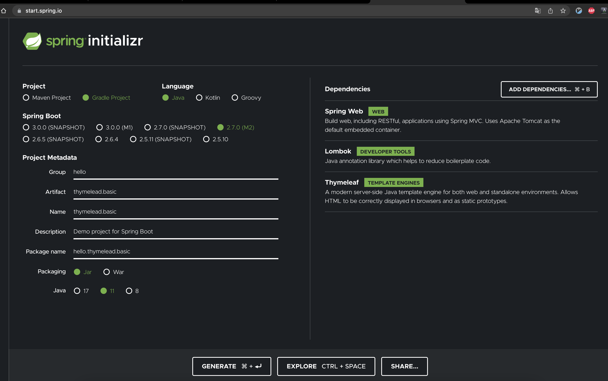
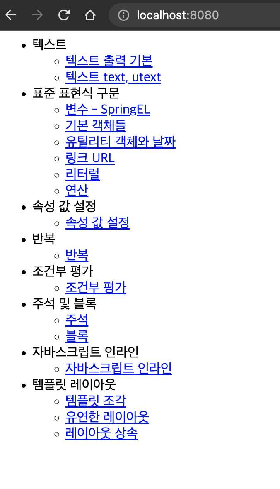
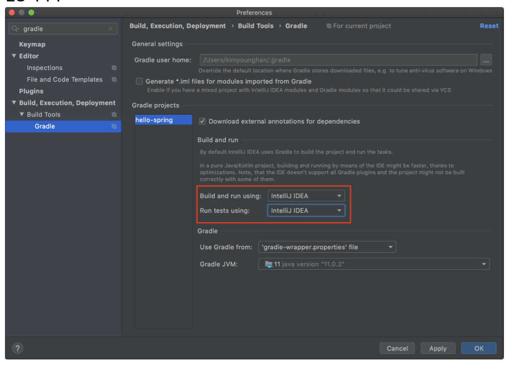

# 타임리프 실습

## 1. 개발 환경 구성

1. <start.spring.io>

2. index.html 구성
[index.html](./thymeleaf-basic/src/main/resources/static/index.html)

1. 실행 <localhost:8080>

### 기타

1. gradle 자바로 직접 실행(속도 향상)

2. 롬복 적용
   - Preferences plugin lombok 검색 실행 (재시작)
   - Preferences Annotation Processors 검색 Enable annotation processing 체크
3. postman 설치

## 2. 타임리프 소개

- 공식 사이트: https://www.thymeleaf.org/
- 공식 메뉴얼 - 기본 기능: https://www.thymeleaf.org/doc/tutorials/3.0/usingthymeleaf.html 
- 공식 메뉴얼 - 스프링 통합: https://www.thymeleaf.org/doc/tutorials/3.0/thymeleafspring.html

- 타임리프는 백엔드 서버에서 HTML을 동적으로 렌더링 하는 용도로 사용된다
- 타임리프는 순수 HTML을 최대한 유지하는 특징이 있다.
- 순수 HTML을 그대로 유지하면서 뷰 템플릿도 사용할 수 있는 타임리프의 특징을 네츄럴 템플릿 (natural templates)이라 한다.

- 사용 선언
  - `<html xmlns:th="http://www.thymeleaf.org">`

- 기본 표현식
  - https://www.thymeleaf.org/doc/tutorials/3.0/usingthymeleaf.html#standard-expression-syntax

## 텍스트 : text, utext

기본 문법, 사용법 등 코드
- [BasicController](./thymeleaf-basic/src/main/java/hello/thymeleafbasic/basic/BasicController.java)
- [basic-html](./thymeleaf-basic/src/main/resources/templates/basic/text-basic.html)

### Escape

- HTML문서는 <,> 같은특수문자를기반으로정의된다.
- 따라서 뷰템플릿으로 HTML화면을 생성할 때는 출력하는 데이터에 이러한 특수 문자가 있는 것을 주의해서 사용해야 한다

- [basic-unescaped](./thymeleaf-basic/src/main/resources/templates/basic/text-unescaped.html)
  - `th:inline="none"` : 타임리프는 [[...]] 를 해석하기 때문에, 화면에 [[...]] 글자를 보여줄 수 없다. 
  - 이 태그 안에서는 타임리프가 해석하지 말라는 옵션

> 실제 서비스를 개발하다 보면 escape를 사용하지 않아서 HTML이 정상 렌더링 되지 않는 수 많은 문제가 발생한다. 
> escape를 기본으로 하고, 꼭 필요한 때만 unescape를 사용하자.

## 변수 : SpringEL

기본문법, 사용법 등 코드
- [BasicController](./thymeleaf-basic/src/main/java/hello/thymeleafbasic/basic/BasicController.java)
- [variable-html](./thymeleaf-basic/src/main/resources/templates/basic/variable.html)

- 정리하면...
- Object
  - user.username : user의 username을 프로퍼티 접근
  - user['username'] : 위와 같음 
  - user.getUsername() : user의 getUsername() 을 직접 호출

- List
  - users[0].username : List에서 첫 번째 회원을 찾고 username 프로퍼티 접근
  - list.get(0).getUsername() users[0]['username'] : 위와 같음
  - users[0].getUsername() : List에서 첫 번째 회원을 찾고 메서드 직접 호출 

- Map
  - userMap['userA'].username : Map에서 userA를 찾고, username 프로퍼티 접근 -> map.get("userA").getUsername()
  - userMap['userA']['username'] : 위와 같음 
  - userMap['userA'].getUsername() : Map에서 userA를 찾고 메서드 직접 호출

- 지역변수
  - th:with 를 사용하면 지역 변수를 선언해서 사용할 수 있다
  - 지역 변수는 선언한 태그 안에서만 사용할 수 있음

## 기본 객체들

- 타임리프는 기본 객체들을 제공한다. 
  - ${#request}
  - ${#response}
  - ${#session} 
  - ${#servletContext} 
  - ${#locale}

- [BasicController](./thymeleaf-basic/src/main/java/hello/thymeleafbasic/basic/BasicController.java)
- [basic-objects](./thymeleaf-basic/src/main/resources/templates/basic/basic-objects.html)

- HTTP 요청 파라미터 접근: param 
  - 예) ${param.paramData}
- HTTP 세션 접근: session
  - 예) ${session.sessionData}
- 스프링 빈 접근: @
  - 예) ${@helloBean.hello('Spring!')}

- 실행
  - <http://localhost:8080/basic/basic-objects?paramData=HelloParam>

## 유틸리티 객체, 날짜

- 타임리프는 문자, 숫자, 날짜 등 기본 유틸리티 객체들을 제공함
- 필요하면 찾아서 쓰면됨
l
- 타임리프 유틸리티 객체들
  - `#message` : 메시지, 국제화 처리
  - `#uris` : URI 이스케이프 지원
  - `#dates` : java.util.Date 서식 지원 #calendars : java.util.Calendar 서식 지원 #temporals : 자바8 날짜 서식 지원
  - `#numbers` : 숫자 서식 지원
  - `#strings` : 문자 관련 편의 기능
  - `#objects` : 객체 관련 기능 제공
  - `#bools` : boolean 관련 기능 제공
  - `#arrays` : 배열 관련 기능 제공
  - `#lists` , `#sets` , `#maps` : 컬렉션 관련 기능 제공 #ids : 아이디 처리 관련 기능 제공, 뒤에서 설명

- 타임리프 유틸리티 객체
  - <https://www.thymeleaf.org/doc/tutorials/3.0/usingthymeleaf.html#expression-utility-objects>
- 유틸리티 객체 예시
  - <https://www.thymeleaf.org/doc/tutorials/3.0/usingthymeleaf.html#appendix-b-expression-utility-objects>

- 자바8 날짜
  - 타임리프에서 자바8 날짜인 LocalDate , LocalDateTime , Instant 를 사용하려면 추가 라이브러리가 필요하다. 
  - 스프링 부트 타임리프를 사용하면 해당 라이브러리가 자동으로 추가되고 통합된다
    - `thymeleaf-extras-java8time`
  - [BasicController](./thymeleaf-basic/src/main/java/hello/thymeleafbasic/basic/BasicController.java)
  - [date](./thymeleaf-basic/src/main/resources/templates/basic/date.html)

## URL, 링크

- [BasicController](./thymeleaf-basic/src/main/java/hello/thymeleafbasic/basic/BasicController.java)
- [link](./thymeleaf-basic/src/main/resources/templates/basic/link.html)
  - 단순 url
    - @{/hello} -> /hello
  - 쿼리 파라미터
    - @{/hello(param1=${param1}, param2=${param2})}
      - /hello?param1=data1&param2=data2
    - () 에 있는 부분은 쿼리 파라미터로 처리된다.
  - 경로 변수
    - @{/hello/{param1}/{param2}(param1=${param1}, param2=${param2})}
      - /hello/data1/data2
    - URL 경로상에 변수가 있으면 () 부분은 경로 변수로 처리된다.
  - 경로 변수 + 쿼리 파라미터 
    - @{/hello/{param1}(param1=${param1}, param2=${param2})}
      - /hello/data1?param2=data2
    - 경로 변수와 쿼리 파라미터를 함께 사용할 수 있다.

> 참고
> <https://www.thymeleaf.org/doc/tutorials/3.0/usingthymeleaf.html#link-urls>